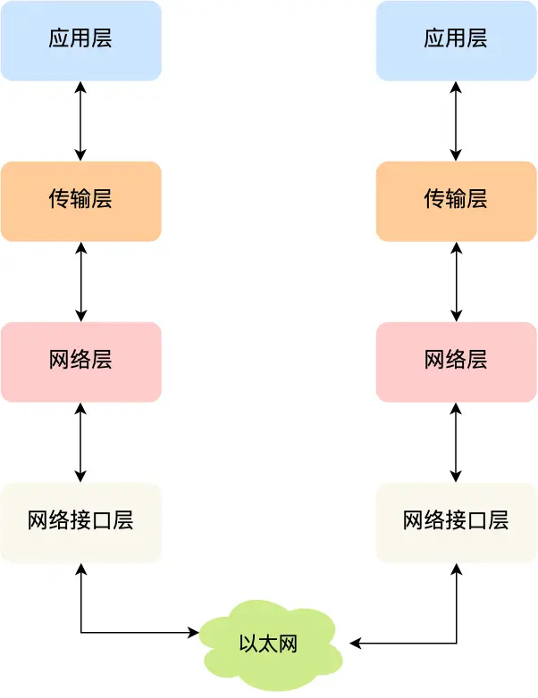

# 基础部分

## 应用层

应用层是工作在操作系统中的用户态，传输层及以下则工作在内核态。

## 传输层

传输层秉持着`简单`、`高效`、`专注`的设计理念。
传输层

### 传输层的两个传输层协议

#### TCP

`可靠，面向连接`

TCP 的全称叫传输控制协议（Transmission Control Protocol），大部分应用使用的正是 TCP 传输层协议，比如 HTTP 应用层协议。TCP 相比 UDP 多了很多特性，比如流量控制、超时重传、拥塞控制等，这些都是为了保证数据包能可靠地传输给对方。

#### UDP

`不可靠，不需要对方确认`

UDP 相对来说就很简单，简单到只负责发送数据包，不保证数据包是否能抵达对方，但它实时性相对更好，传输效率也高。

应用需要传输的数据可能会非常大，如果直接传输就不好控制，因此当传输层的数据包大小超过 MSS（TCP 最大报文段长度） ，就要将数据包分块，这样即使中途有一个分块丢失或损坏了，只需要重新发送这一个分块，而不用重新发送整个数据包。在 TCP 协议中，我们把每个分块R为一个 TCP 段（TCP Segment）。

## 网络层

主要的协议：`IP协议`

# Test

```mermaid
graph TD;
    A-->B;
    A-->C;
    B-->D;
    C-->D;
```

```mermaid
graph LR
    fa:fa-check-->fa:fa-coffee
```

``综上所述，TCP/IP 网络通常是由上到下分成 4 层，分别是应用层，传输层，网络层和网络接口层。``

TCP/IP 网络四层

每一层的封装格式

