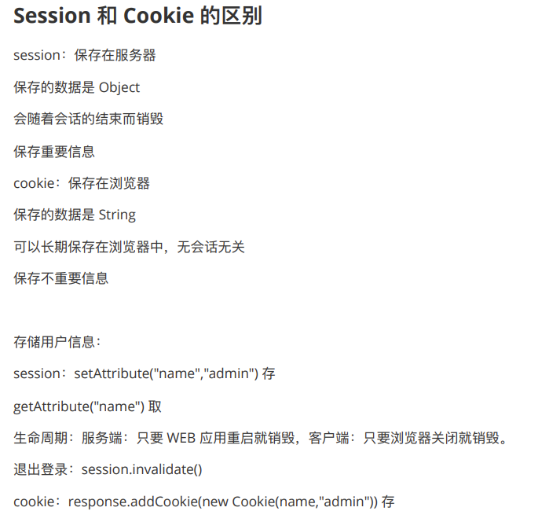

## Session 和 Cookie 的区别




session：保存在服务器

保存的数据是 Object
会随着会话的结束⽽销毁
保存重要信息

cookie：保存在浏览器

保存的数据是 String
可以⻓期保存在浏览器中，⽆会话⽆关
保存不重要信息
存储⽤户信息：
```session：setAttribute("name","admin")``` 存
``getAttribute("name")`` 取

⽣命周期：服务端：只要 WEB 应⽤重启就销毁，客户端：只要浏览器关闭就销毁。

退出登录：

```java
session.invalidate()
cookie：response.addCookie(new Cookie(name,"admin")) 存
Cookie[] cookies = request.getCookies();
for (Cookie cookie:cookies){
out.write(cookie.getName()+":"+cookie.getValue()+"<br/>");
}
```

取
⽣命周期：不随服务端的重启⽽销毁，客户端：默认是只要关闭浏览器就销毁，我们通过 `setMaxAge()`
⽅法设置有效期，⼀旦设置了有效期，则不随浏览器的关闭⽽销毁，⽽是由设置的时间来决定。
退出登录：`setMaxAge(0)`
