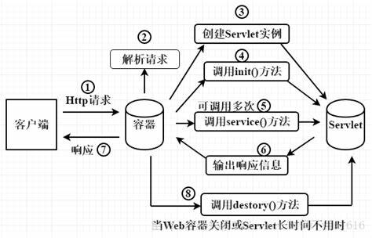
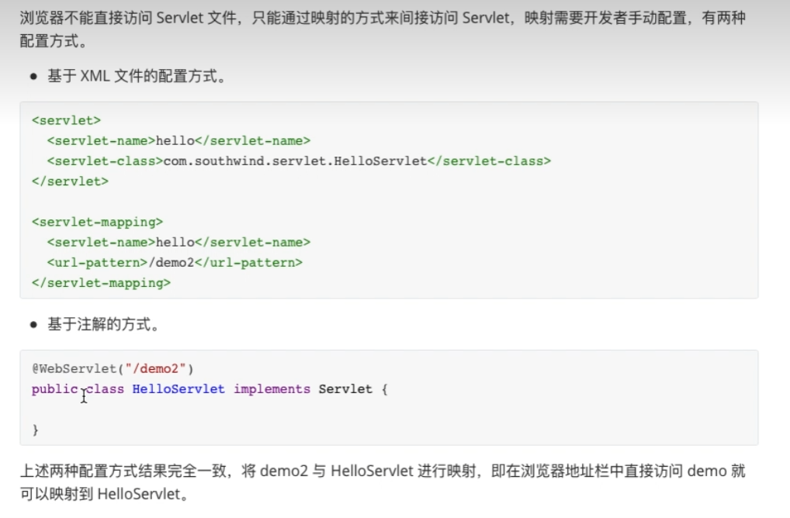
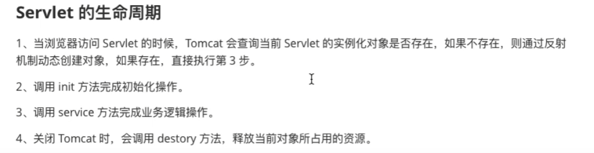

# servlet 套路

1. 创建 form 表单，确定提交方式

2. 创建 servlet 类：创建类，继承 HttpServlet，该类在 servlet-api.jar；复写 doGet/doPost 方法

3. 配置请求映射

```xml
<servlet>
     <!--servlet名称，与配置文件中的<servlet-mapping>标签中的servlet-name匹配-->
     <servlet-name>servlet01</servlet-name>
     <!--servlet类的全名称，原理：Java反射机制-->
     <servlet-class>com.wxkj.servlet.action.ServletAction</servlet-class>
</servlet>
<servlet-mapping>
      <!--servlet名称，与配置文件中的<servlet>标签中的servlet-name匹配-->
      <servlet-name>servlet01</servlet-name>
      <!--响应请求，当浏览器请求到达时，此处首先匹配-->
      <url-pattern>/form01</url-pattern>
</servlet-mapping>
```

4. 表单的 method 属性决定了 servlet 类对象呗访问的是 doGet 还是 doPost

    - method 属性值为 get，则访问 doGet
    - method 属性值为 post，则访问 doPost
    - 超链接相当于显示提交，访问 doGet
    - 浏览器地址栏直接敲请求，也为 get 方式

5. servlet 生命周期

    - init()初始化方法，当 servlet 被创建时调用，一般做初始化处理
    - service(HttpServletRequest arg0, HttpServletResponse arg1)
        - 整个生命周期过程中调用的方法，所有的请求都走 service 方法
        - 如果 service 方法中调用父类 service 方法，则根据提交方式自动分发给 doGet/doPost 方法
    - destroy()销毁，当 servlet 被销毁时调用，一般做警告处理

6. `<load-on-startup>0</load-on-startup>`

    - 当服务器启动时创建 servlet 实例
        - 标签包裹的部分为整数类型数字
        - 当数字大于等于 0 时，数字越小，创建越早
        - 当数字小于 0 时，等同于不写该标签

7. 自定义方法的使用

    - 创建自定义方法，在 service 方法中进行调用

    - 在请求中添加状态参数，service 根据状态参数来决定调用哪一个自定义方法

## Tomcat 与 Servlet 如何工作的

1. Web Client 向 Servlet 容器发出 Http 请求；
2. Servlet 容器接收 Web Client 的请求；
3. Servlet 容器创建一个 Http Request 对象，将 Web Client 请求信息封装到这个对象中；
4. Servlet 容器创建一个 HttpResponse 对象；
5. Servlet 容器调用 HttpServlet 对象的 Service 方法，把 HttpRequest 对象与 HttpResponse 对象作为参数传给 HttpServlet 对象；
6. HttpServlet 调用 HttpRequest 对象相关方法获取 Http 请求信息；
7. HttpServlet 调用 HttpResponse 对象的相关方法生成响应数据；
8. Servlet 容器把 HttpServlet 的响应结果传给 WebClient;

## Servlet 与 JSP 比较

它们有很多相似之处，都可以生成动态网页

1. JSP 优点是：擅长网页制作，生成动态页面比较直观；
    > 缺点：不容易跟踪与拍错；
2. Servlet 是纯 Java 语言，擅长处理流程和业务逻辑；
    > 缺点：生成动态网页不直观；
3. Servlet 运行速度比 CGI 快，因为使用了多线程；
4. Servlet 使用了标准的 api，可被许多 web 服务支持；
5. Servlet 与系统无关，一次编译多次使用，也正是 Java 的特性；

## Servlet 执行流程

Web 服务器接到 HTTP 请求后，Web 服务器将请求移交给 Servlet 容
器，Servlet 容器首先对所请求的 URL 进行解析并根据 Web.xml 配置
文件找到相应的处理 Servlet,同时将 request、response 对象传递给
Servlet，Servlet 通过 request 对象可知道客户端的请求者请求信息以及其他的信息等，Servlet 在处理完请求后,比如 doGet()和 doPost()会把所有需返回的信息放入
response 对象中并返回到客户端，Servlet 一旦处理完请求，Servlet
容器会刷新 response 对象，并把控制权重新返回给 Web 服务器。

## 创建 Servlet 的时机.

1. Servlet 容器启动时，读取 Web.xml 配置文件中的信息，构造指定的 Servlet 对象，创建 ServletConfig 对象，同时将 ServletConfig 对象作为参数来调用 Servlet 对象 init 方法。

2. 在 Servlet 容器启动后，客户首次向 Servlet 发出请求，Servlet 容器会判断内存中是否存在指定的 Servlet 对象，若没有则根据客户的请求创建 HttpRequest、HttpReponse 对象，从而调用 Servlet 对象的 Service 方法。

3. Servlet 容器在启动时创建的 Servlet 是由在 Web.xml 文件中为 Servlet 设置的`<load-on startup>`属性 决定的，同一类型的 Servlet 对象在 Servlet 容器中以单例的形式存在。

Servlet 流程图


## 执行流程

1.浏览器向服务器发出 GET 请求

2.服务器上的 Tomcat 接收到该 url,根据该 url 判断为 Servlet 请求，此时 Tomcat 将产生两个对象：请求对象(HttpServletRequest)和响应对象(HttpServletResponce)

3.Tomcat 根据 url 找到目标 Servlet,且创建一个线程

4.Tomcat 将刚才创建的请求对象和响应对象传递给该线程

5.Tomcat 调用 Servlet 的 service()方法

6.service()方法根据请求类型(本示例为 GET 请求)调用 doGet()(本示例调用 doGet())或 doPost()方法

7.doGet()执行完后，将结果返回给 Tomcat

8.线程被销毁或被放在线程池中

注意：

1.在容器中的每个 Servlet 原则上只有一个实例

2.每个请求对应一个线程

3.多个线程可作用于同一个 Servlet(这是造成 Servlet 线程不安全的根本原因)

4.每个线程一旦执行完任务，就被销毁或放在线程池中等待回收

Servlet 生命周期
Servlet 的生命周期是由 Tomcat 容器管理的

a) 客户发出请求—>Web 服务器转发到 Web 容器 Tomcat；

b) Tomcat 主线程对转发来用户的请求做出响应创建两个对象：HttpServletRequest 和 HttpServletResponse；

c) 从请求中的 URL 中找到正确 Servlet，Tomcat 为其创建或者分配一个线程，同时把 2 创建的两个对象传递给该线程；

d) Tomcat 调用 Servlet 的 servic()方法，根据请求参数的不同调用 doGet()或者 doPost()方法；

e) 假设是 HTTP GET 请求，doGet()方法生成静态页面，并组合到响应对象里；
Servlet 线程结束，Tomcat 将响应对象转换为 HTTP 响应发回给客户，同时删除请求和响应对象。
从该过程中，我们可以理解 Servlet 的生命周期：Servlet 类加载（对应 3 步）；Servlet 实例化（对应 3 步）；调用 init 方法（对应 3 步）；调用 service()方法（对应 4、5 步）；；调用 destroy()方法（对应 6 步）。

Servlet 运行在 Servlet 容器中，其生命周期由容器来管理。Servlet 的生命周期通过 javax.servlet.Servlet 接口中的 init()、service()和 destroy()方法来表示。

客户端如何访问 servlet 文件


生命周期

