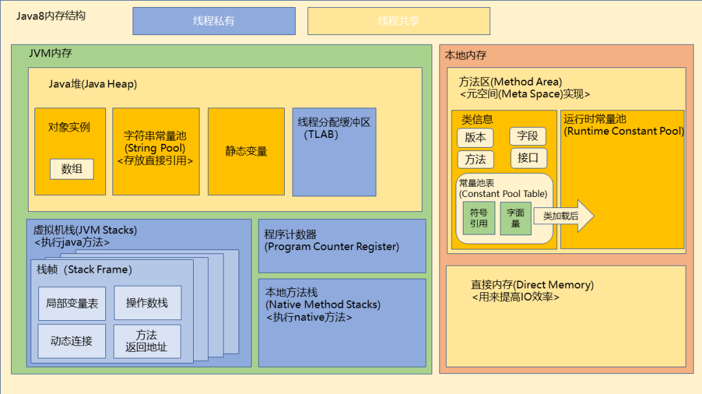

# Java间接引用存在jvm内存结构哪里？

> Java中的间接引用通常是指对象引用，也就是变量中存储的指向对象的内存地址。在Java内存结构中，对象引用通常存储在栈内存中。当我们声明一个对象引用变量时，实际上是在栈内存中分配了一个空间来存储这个引用变量，然后在堆内存中分配了一个空间来存储实际的对象数据，并将对象的内存地址存储在栈内存中的引用变量中。
> 当我们通过对象引用访问对象时，实际上是在栈内存中访问了存储在引用变量中的内存地址，然后根据这个内存地址找到堆内存中存储的对象数据。因此，对象引用实际上是一种指向堆内存中对象数据的指针或句柄。

**jdk8内存结构**
