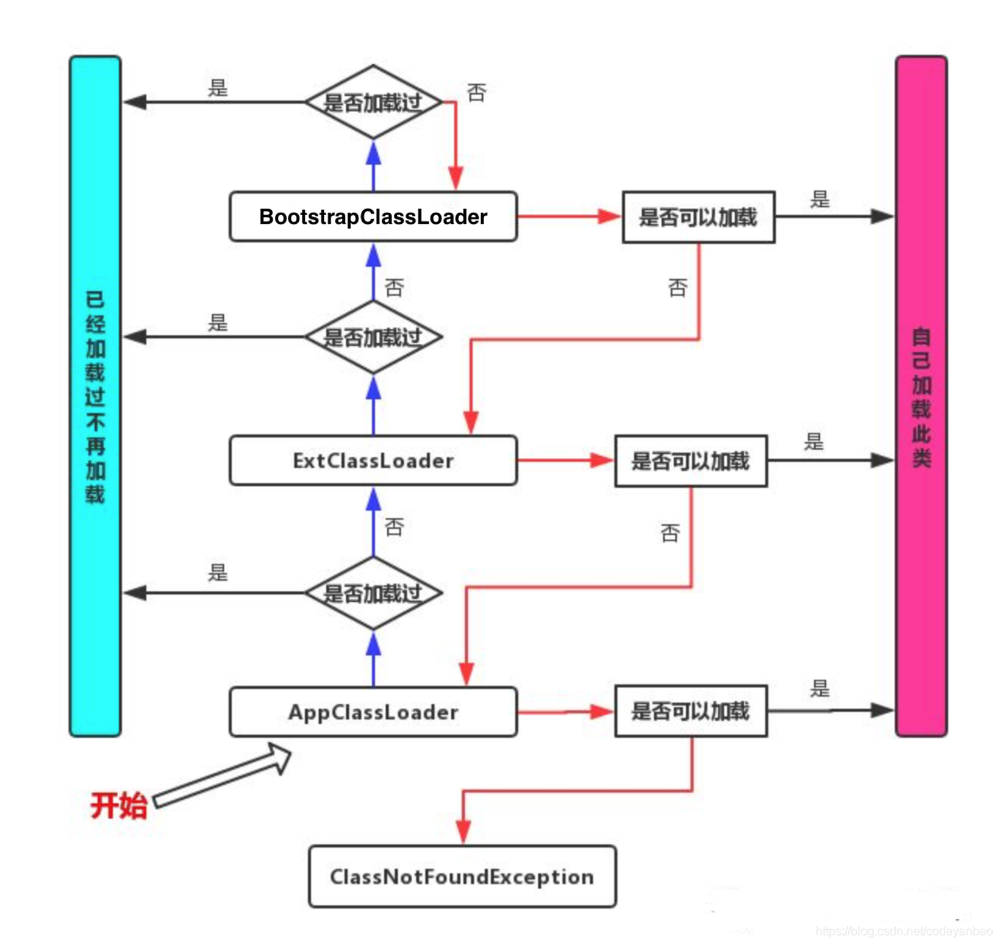
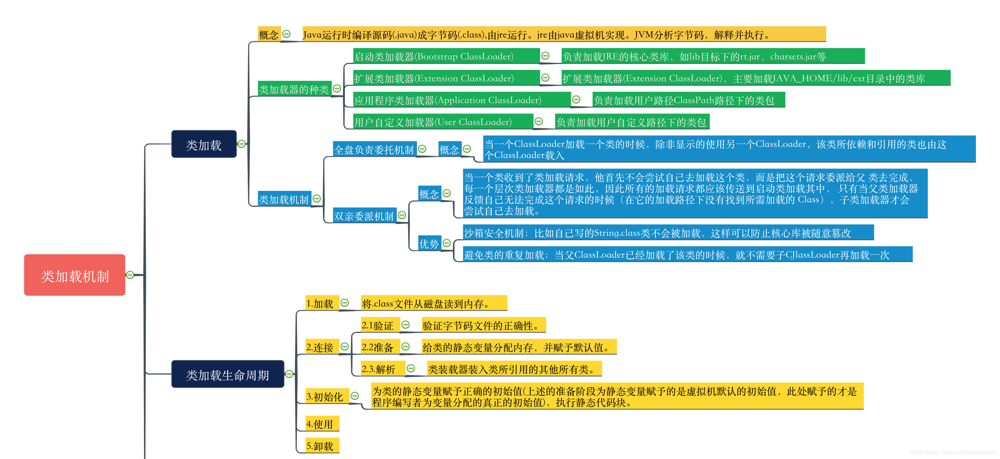
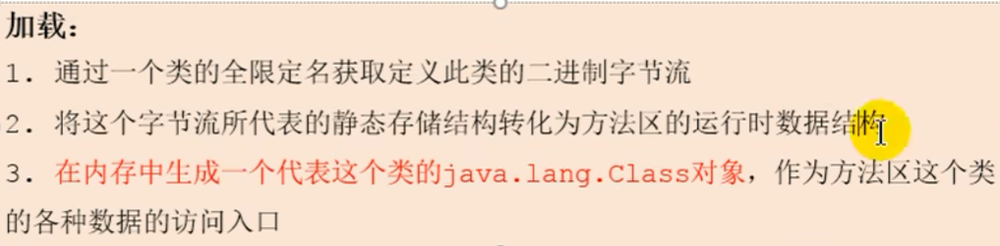
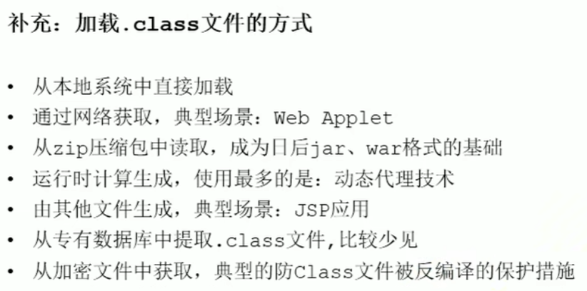

# 双亲委派机制

## Java类加载过程

`顺序从下往上`

- `BootstrapClassLoader`:主要负责加载核心的类库(java.lang.*等)，构造ExtClassLoader和APPClassLoader。

- `ExtClassLoader`：主要负责加载jre/lib/ext目录下的一些扩展的jar。

- `AppClassLoader`：主要负责加载应用程序的主函数类

- `UserClassLoader`: 用户自定义加载类

## 双亲委派机制流程

当一个Hello.class这样的文件要被加载时。不考虑我们自定义类加载器，首先会在`AppClassLoader`中检查是否加载过，如果有那就无需再加载了。如果没有，那么会拿到父加载器，然后调用父加载器的`loadClass`方法。父类中同理也会先检查自己是否已经加载过，如果没有再往上。注意这个类似递归的过程，直到到达`BootstrapClassLoader`之前，都是在检查是否加载过，并不会选择自己去加载。直到`BootstrapClassLoader`，已经没有父加载器了，这时候开始考虑自己是否能加载了，如果自己无法加载，会下沉到子加载器去加载，一直到最底层，如果没有任何加载器能加载，就会抛出ClassNotFoundException。

## 双亲委派机制实现代码



```java
    public Class<?> loadClass(String name) throws ClassNotFoundException {
        return loadClass(name, false);
    }
    //              -----??-----
    protected Class<?> loadClass(String name, boolean resolve)
        throws ClassNotFoundException
    {
            // 首先，检查是否已经被类加载器加载过
            Class<?> c = findLoadedClass(name);
            if (c == null) {
                try {
                    // 存在父加载器，递归的交由父加载器
                    if (parent != null) {
                        c = parent.loadClass(name, false);
                    } else {
                        // 直到最上面的Bootstrap类加载器
                        c = findBootstrapClassOrNull(name);
                    }
                } catch (ClassNotFoundException e) {
                    // ClassNotFoundException thrown if class not found
                    // from the non-null parent class loader
                }
 
                if (c == null) {
                    // If still not found, then invoke findClass in order
                    // to find the class.
                    c = findClass(name);
                }
            }
            return c;
    }
```

## 双亲委派机制脑图



## 为什么要设计这种机制？

这种设计有个好处是，如果有人想替换系统级别的类：String.java。篡改它的实现，在这种机制下这些系统的类已经被`BootstrapClassLoader`加载过了（为什么？因为当一个类需要加载的时候，最先去尝试加载的就是`BootstrapClassLoader`），所以其他类加载器并没有机会再去加载，从一定程度上防止了危险代码的植入。

## 补充（机制加载流程和优缺点）



加载class文件的方式
