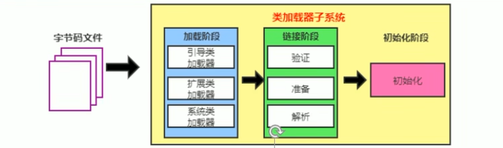

# 类加载器ClassLoader

***

ClassLoader只负责class文件的加载，至于运行，则由Excution Engine负责。

加载的类信息存放于一块称为方法区的内存空间。除了类的信息外，方法区中还存放运行时常量池信息，可能还包括字符串字面量和数字常量（这部分常量信息是class文件中常量池部分的内存映射）

常量池运行加载到内存，就叫做运行时常量池。

字节码文件到类加载子系统

