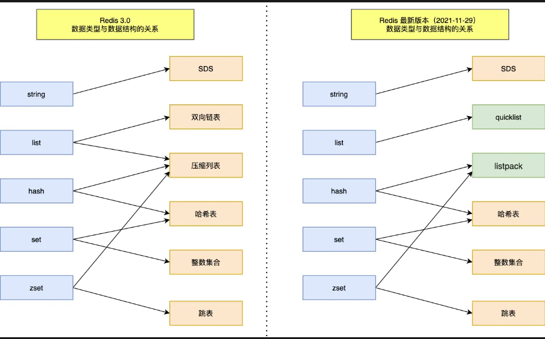

# Redis常见面经

## Redis数据类型和数据结构

数据类型和其对应的数据结构如下图所示：

数据结构如下图所示：

## Redis的使用场景

Redis（Remote Dictionary Server）是一个基于内存的高性能**键值（Key-Value）**存储数据库，它支持多种数据结构（如**字符串、列表、哈希表、集合**等）和丰富的操作命令，被广泛应用于**缓存、会话管理、消息队列、计数器、分布式锁**等各种场景。

### Redis 的使用场景

1. **缓存**
2. **数据共享分布式**
3. **分布式锁**
4. **全局ID**
5. **计数器**
6. **限流**
7. **位统计**
8. **购物车**
9. **用户消息时间线timeline**
10. **消息队列**
11. **抽奖**
12. **点赞、签到、打卡**
13. **商品标签**
14. **商品筛选**
15. **用户关注、推荐模型**
16. **排行榜**

### 缓存穿透（Cache Penetration）

缓存穿透是指**恶意请求或者查询不存在的数据**，导致缓存和数据库都无法命中，每次请求都需要到数据库中查询，从而给数据库造成压力。解决方案通常包括使用**布隆过滤器、空值缓存**等手段来防止无效的请求达到数据库。

### 缓存击穿（Cache Miss）

缓存击穿是**指一个热点 key 在缓存过期后，同时有大量并发请求访问该 key**，导致所有请求都直接访问数据库，而没有命中缓存。解决方案包括在缓存失效时加上互斥锁，使只有一个线程去查询数据库并更新缓存，其他线程等待结果。

### 缓存雪崩（Cache Avalanche）

缓存雪崩是指**缓存中的大量数据同时过期**，导致**大量请求直接打到数据库上**，造成数据库压力剧增，甚至导致宕机。解决方案包括给缓存设置不同的过期时间，避免大量数据同时过期；使用热点数据预热等方法来尽量避免缓存雪崩的发生。

### 数据过期和数据淘汰策略

在 Redis 中，可以通过设置数据的过期时间来管理缓存的有效期。当数据过期时，可以根据配置的淘汰策略来决定是立即删除过期数据，还是在被访问时进行删除。Redis 提供了以下几种数据淘汰策略：

1. **定时过期（TTL）**：设置数据的过期时间，Redis 会在数据到达过期时间后自动删除。
2. **惰性删除**：在访问数据时检查数据是否过期，如果过期则立即删除。
3. **定期删除**：定期地扫描数据库，删除过期的数据。
4. **LRU 淘汰**：根据最近最少使用原则（LRU，Least Recently Used）删除最近最少使用的数据。

合理选择数据过期和淘汰策略，可以有效地管理缓存，提高系统的性能和可靠性。