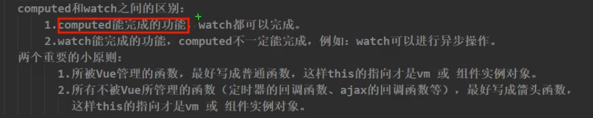
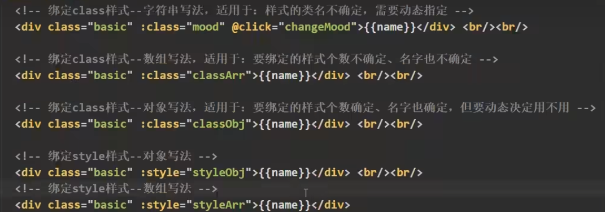
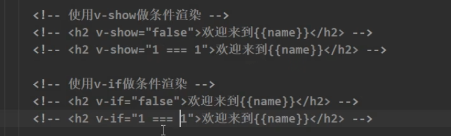
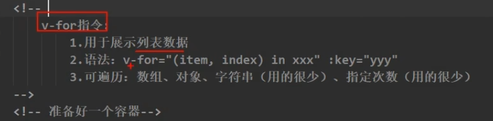
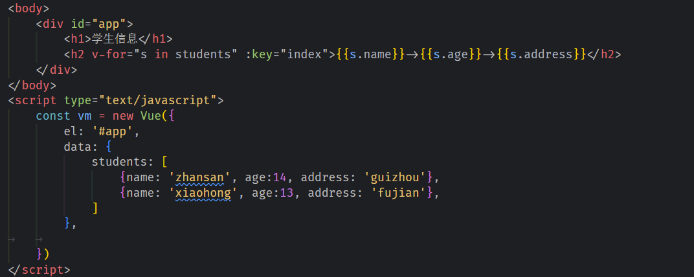
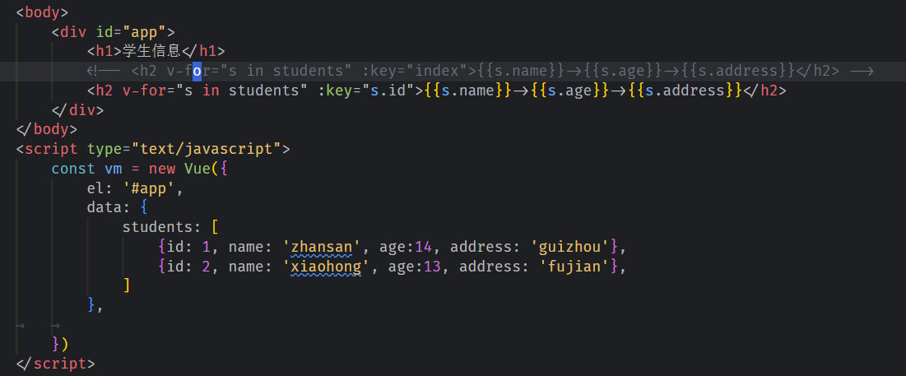
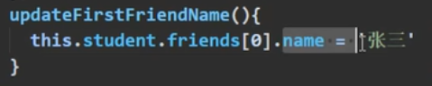

b# 杂汤

1. 定时器所指定的回调函数是由js引擎所指定的。

2. computed和watch的区别

3. vue不建议直接操作dom

4. 绑定class样式和style样式

5. 条件渲染,v-show和v-if做条件渲染

6. v-for实现列表渲染

>其中的key需要用v-bind动态绑定，并且必须保证唯一性。

7. 所被Vue管理的函数，最好写成普通函数，这样this的指向才是vm 或 组件实例对象。

 

8. 所有不被Vue所管理的函数（定时器的回调函数、ajax的回调函数等、Promise的回调函数），最好写成箭头函数，这样this的指向才是vm。

 

9.  数据监测过程中，data中的数据都是通过getter和setter来监测的，Vue通过Observer构造函数创建一个检测实例对象，来监视data中属性的变化。

 

10. 不做**删除**和**排序**的时候:key可以指定为默认的**index**如下图一，否则需要指定为**唯一主键**,如下图二。

11. 不能直接通过数组下标修改对象属性或者添加删除等操作。

12. 11中的问题需要通过js7个原生修改数组方法才能除法Vue的视图解析。

13. 每个数据经过数据代理的过程就叫数据劫持。