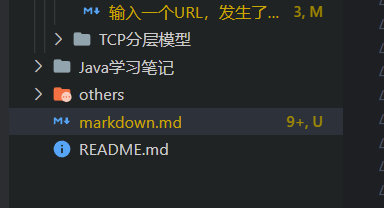

# h1
## h2
*倾斜*

**加粗**

分割线

---

***

> 高亮文字


* 段落一
    > 区块标记一
* 段落二
    > 区块标记二

```java
fun (x: Int, y: Int): Int {
  return x + y
}
```

<font color='#ff0000'>我是红色</font>

<font size=1> 缩小字体大小为1</font>


:smile:
:angry:
:cry:
:weary:			//疲倦的
:flushed:		//兴奋的
:imp:			//魔鬼

H~2~0

x^2

==asd==

<button>example</button>


<u>下划线</u>

~~删除线~~

我是截图



- [ ] a
+ [x] b
* [ ] c

``TODO``