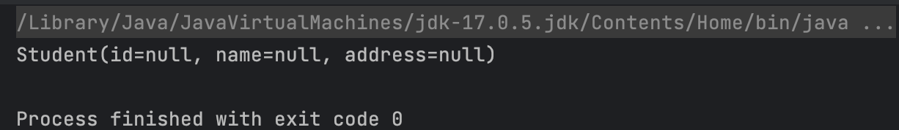

# Spring 学习笔记

## 配置文件

`resources/sping`

```xml
<?xml version="1.0" encoding="UTF-8"?>
<beans xmlns="http://www.springframework.org/schema/beans"
       xmlns:xsi="http://www.w3.org/2001/XMLSchema-instance"
       xsi:schemaLocation="http://www.springframework.org/schema/beans http://www.springframework.org/schema/beans/spring-beans.xsd">
</beans>
```

- 通过配置 `bean`实现对对象的管理

  - `id`:对象名
  - `class`:对象的模板类（所有提交给 IoC 容器管理的类必须有无参构造函数，因为 Spring 底层通过反射机制来创建对象，调用的是无参构造）
- 对象的成员变量通过 `property`标签来完成赋值。

  - `name`:成员变量名
  - ` value`:成员变量值(基本数据类型，String 可以直接赋值，如果是其他引用类型，不能通过 value 赋值。)
  - `ref`: 将 IoC 中另外一个 `bean`赋值给当前的成员变量(DI)

```xml
<?xml version="1.0" encoding="UTF-8"?>
<beans xmlns="http://www.springframework.org/schema/beans"
       xmlns:xsi="http://www.w3.org/2001/XMLSchema-instance"
       xsi:schemaLocation="http://www.springframework.org/schema/beans http://www.springframework.org/schema/beans/spring-beans.xsd">

    <bean id="student" class="com.aoeivux.entity.Student" >
        <property name="id" value="1"></property>
        <property name="name" value="zs"></property>
        <property name="address" ref="address"></property>
    </bean>

    <bean id="address" class="com.aoeivux.entity.Address">
        <property name="id" value="1"></property>
        <property name="name" value="长春路"></property>
    </bean>
</beans>
```

IoC 底层反射机制创建对象

```java
    @org.junit.Test
    public void test2() {
        try {
            Class<?> address = Class.forName("com.aoeivux.entity.Address");
            Constructor<?> constructor = address.getConstructor(Integer.class, String.class);
            Object o = constructor.newInstance(1, "贵州");
            System.out.println(o);
        } catch (ClassNotFoundException e) {
            throw new RuntimeException(e);
        } catch (NoSuchMethodException e) {
            throw new RuntimeException(e);
        } catch (InvocationTargetException e) {
            throw new RuntimeException(e);
        } catch (InstantiationException e) {
            throw new RuntimeException(e);
        } catch (IllegalAccessException e) {
            throw new RuntimeException(e);
        }
    }

```

## IoC 底层原理

- 读取配置文件，解析 XML。
- 通过反射机制实例化配置文件中所配置的所有bean。

- 自定义`ClassPathXmlApplicationContext`类和`ApplicationContext`接口,使用`dom4j`解析XML，获取数据

```java
package com.aoeivux.ioc;


import com.aoeivux.entity.Address;
import org.dom4j.Document;
import org.dom4j.DocumentException;
import org.dom4j.Element;
import org.dom4j.io.SAXReader;
import org.xml.sax.SAXException;

import java.lang.reflect.Constructor;
import java.lang.reflect.InvocationTargetException;
import java.util.HashMap;
import java.util.Iterator;
import java.util.Map;

public class ClassPathXmlApplicationContext implements ApplicationContext {
    private Map<String, Object> ioc = new HashMap<>();
    public ClassPathXmlApplicationContext(String path){
        try {
            SAXReader reader = new SAXReader();
            Document document = reader.read(path);
            Element root = document.getRootElement();
            Iterator<Element> iterator = root.elementIterator();
            while(iterator.hasNext()) {
                Element element = iterator.next();
//                System.out.println(element);
                String id = element.attributeValue("id");
                String className = element.attributeValue("class");
                Class<?> aClass = Class.forName(className);
                Constructor<?> constructor = aClass.getConstructor();
                Object o = constructor.newInstance();
                ioc.put(id, o);
            }
        } catch (DocumentException e) {
            throw new RuntimeException(e);
        } catch (ClassNotFoundException e) {
            throw new RuntimeException(e);
        } catch (NoSuchMethodException e) {
            throw new RuntimeException(e);
        } catch (InvocationTargetException e) {
            throw new RuntimeException(e);
        } catch (InstantiationException e) {
            throw new RuntimeException(e);
        } catch (IllegalAccessException e) {
            throw new RuntimeException(e);
        }

    }
    @Override
    public Object getBean(String id) {
        return ioc.get(id);
    }

}
```

```java
package com.aoeivux.ioc;

public interface ApplicationContext {
    Object getBean(String id);
}
```

测试
```java
package com.aoeivux;

import com.aoeivux.entity.Student;
import com.aoeivux.ioc.ApplicationContext;
import com.aoeivux.ioc.ClassPathXmlApplicationContext;

public class TestCustomClassPathXmlApplicationContext {
    public static void main(String[] args) {
        ApplicationContext applicationContext = new ClassPathXmlApplicationContext("src/main/resources/spring.xml");
        Student student = (Student) applicationContext.getBean("student");
        System.out.println(student);
    }
}

```

结果
