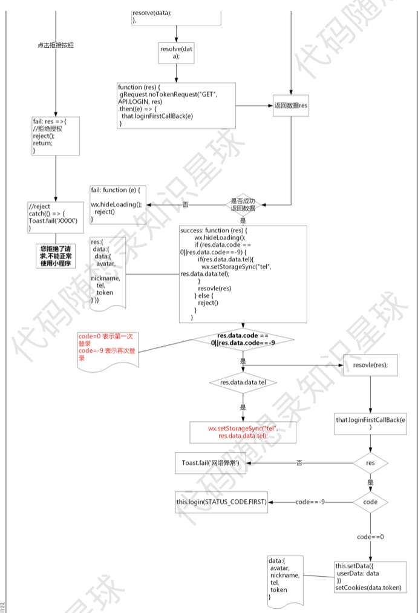
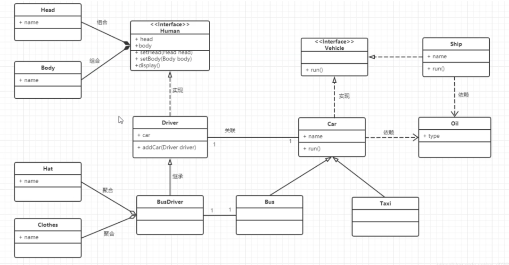
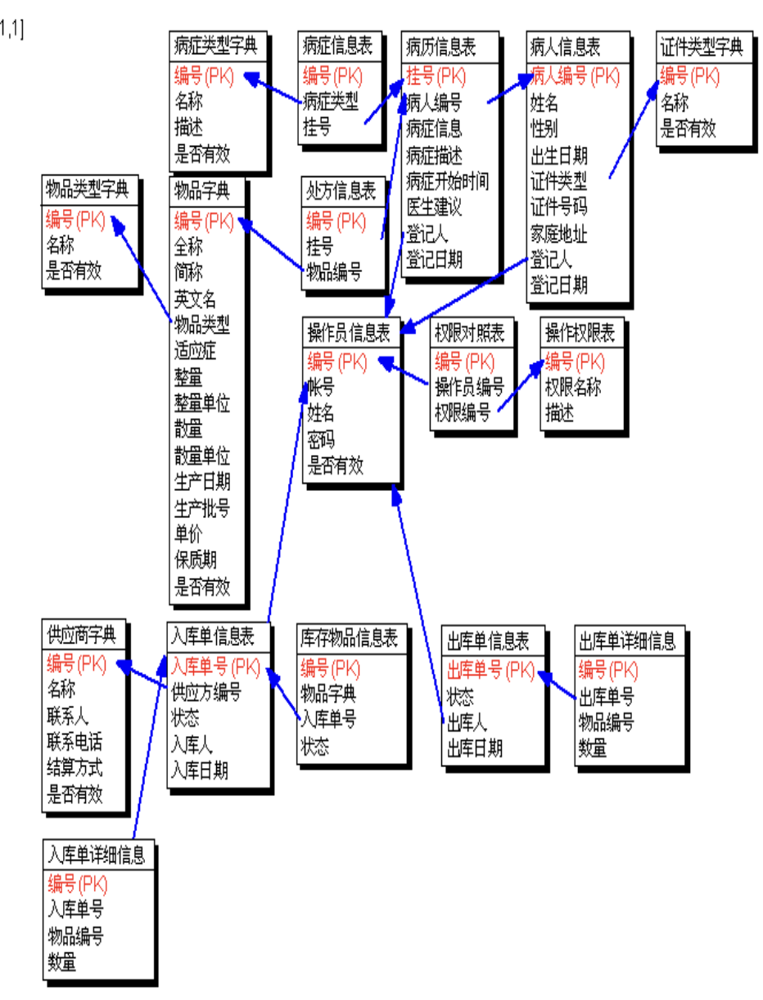
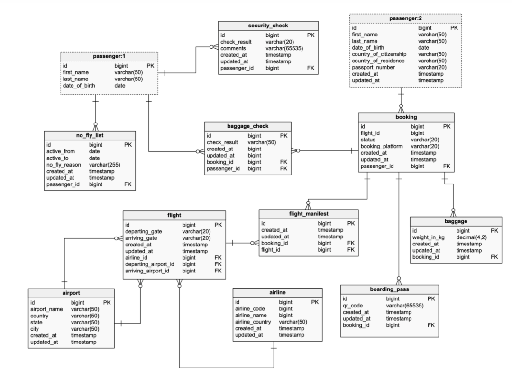

# 杂技


## 刚做项目需要面临的问题

> 问题

1. 我需要继续这样下去吗？看一个视频跟着敲一个？
2. 在敲的过程中，需要思考些什么？或者说，需要重点关注什么？
3. 有没有其他更高效的方法？
4. 如果需要记笔记，需要记下什么内容？
5. 如何解决遗忘的问题(感觉写完一个功能，就又忘了一个功能…….)

> 回答

刚开始做这个项目，代码能力比较弱的话，可以就按照视频敲一遍。

但不要仅仅照着视频敲一遍就完事了，最好同时画出三张图，分别是流程图，UML（类图），还有ER图，来帮助我们第二次独立自己开发项目。

流程图，例如这样：



很多录友自己跟着视频做完一遍，自己独立实现完全没思路，不是代码层面的原因是流程上已经不记得了，所以 第一次看视频做完项目，把流程图画出来很冲要。

还要再画个UML（类图），也就是 类的继承关系，因为如果是一个相对大一些的项目，在一个基类都会派生出很多继承类，而且继承关系还挺复杂，有一个类图，可以帮助大家分析清楚项目里 各个对象之间的关系。

UML（类图） 就是这样的：



ER图，用来画出数据库里各个表的关系，把这个图画出来，数据的业务逻辑就很清晰了。大家的ER图可以这样画，比较直观：



当然规范一点的ER图是这样的：



能把这三个图画出来，说明这个项目自己吸收的差不多，第二次自己独立开发 问题就不大了。

此时就不用再去看视频，不会的内容自己去搜索引擎去查，遇到bug ，自己尝试去解决。这个过程会比较痛苦，但如果你坚持下来了，代码能力一定会有质的飞跃。

这样第二遍下来，这个项目就算是彻底掌握了，但这还不够，因为视频里教的都是最基础的，大家都一样的，需要做一做自己有特色的功能点。

如果第二遍你 确实是自己独立写的，相信在写的过程中，你一定有自己的思考了，哪里可以在优化优化，还能再添加哪些功能。

在时间比较紧张的情况下，聚焦controller层的代码源码就可以了，了解业务逻辑。

之后在根据面经来抓住这个项目里的重点，例如哪里是面试官经常考察的，哪里是面试官会问有没有优化的。

## Scala中的 case class，class，object和case object区别
在Scala中，case class，class，object和case object是用来定义类和对象的关键字，它们在功能和用法上有一些区别。

case class: case class用于定义一个具有不可变状态（immutable state）的类。它通常用于模式匹配（pattern matching），因为它自动提供了一些有用的方法，如equals，hashCode和toString等。它还为每个构造参数自动创建了一个访问器（accessor）方法，并且可以使用copy方法创建对象的副本。case class的实例通常用于表示数据结构或消息传递对象。

```scala
case class Person(name: String, age: Int)
val person = Person("John", 30)
class: class用于定义一个普通的类，它可以具有可变状态（mutable state）。你可以在类中定义方法、字段和构造函数。class是Scala中定义类的主要关键字。
```

```scala
class Person(var name: String, var age: Int)
val person = new Person("John", 30)
```

object: object用于定义一个单例对象，也就是一个类的唯一实例。它类似于Java中的静态类，但更强大。object可以包含方法、字段和构造函数，它们可以直接通过对象名进行访问，而无需创建对象的实例。

```scala
object MySingleton {
  def hello(): Unit = {
    println("Hello, world!")
  }
}
MySingleton.hello()
```

case object: case object是一个特殊的单例对象，它具有与case class类似的特性，但没有构造参数。case object通常用于表示枚举值或单例消息。

case object MyMessage
trait: trait用于定义接口或特征，它可以包含抽象方法、具体方法、字段和属性。trait类似于Java中的接口，但可以包含实现代码。它们可以被类或对象继承，并用于实现多重继承。

```scala
trait Printable {
  def print(): Unit
}
class MyClass extends Printable {
  override def print(): Unit = {
    println("Printing...")
  }
}
```