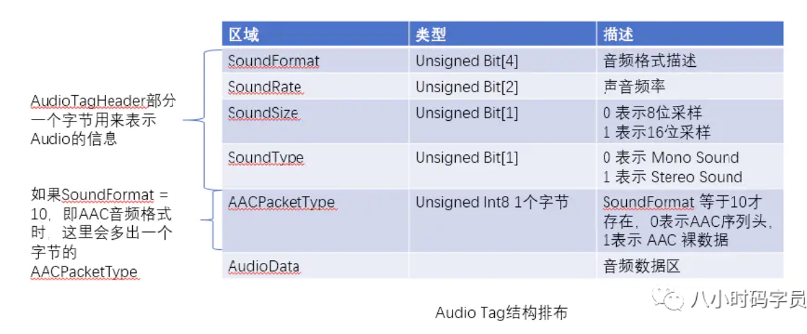
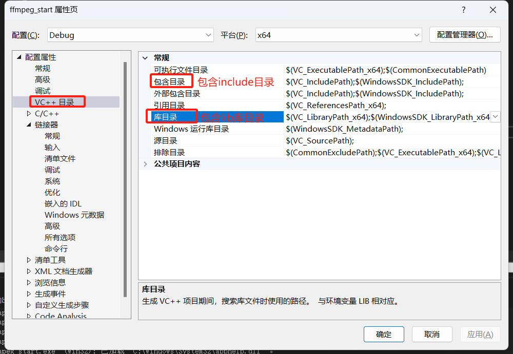

# 音视频


## **流媒体学习框架图**


## 音视频播放原理

​		音视频播放的分类，直观应用上，音视频播放主要分为两大类：在线播放和本地播放。在线播放即通过互联网，在线播放音视频；本地播放及播放本地存放的音视频文件。

​		音视频播放的原理主要分为：**解协议->解封装->解码->音视频同步->播放**。当然，如果是本地播放，没有解协议这一步骤。

​		音视频播放的原理如下（大家可以想象成**剥洋葱一样**，音视频播放其实**是一层层的去除协议、封装，再解码，最后得到原始数据）：**


## 录播、点播、直播

​		**录播**：录播更侧重于“录”，比如录播系统，主要集成了音视频的采集、后期剪辑、工具软件的系统。通俗的讲录播就是**生产音视频**。


​		**点播**：点播从字面意义上讲是播放选择的视频，比如观看爱奇艺、腾讯等视频网站的电影和综艺，**可以随意拖动视频进度**，这些音视频共性特点是**提前录制好的**。通俗的讲点播就是播放**录制好的视频**，点播是**消费音视频**。


​		**直播**：直播相对好理解，虎牙、斗鱼等直播平台上的游戏、才艺直播，这些音视频共性特点是实时的，观看者**不能拖动音视频进度**。通俗的讲直播就是播放**实时直播视频**，直播**既生产又消费音视频**。


## 图像篇（YUV和RGB）

​		YUV，RGB，包括YcbCr是色彩空间的模型，而平常所说的BMP、PNG、JPEG是文件的存储形式。而YUV是音视频（**编解码**）最常用的格式。

YUV(简单来说是指**亮度、色相、饱和度**，下面的表达即指像素点对这三个值的存储。

YUV是一种颜色编码系统，通常用于数字视频和图像处理。**它将亮度（Y）与色度（UV）分离，使其更适合于视频压缩和传输**。在YUV中：

1. Y代表亮度（Luma），表示图像的灰度信息或亮度信息。
2. U和V代表色度（Chrominance），表示颜色信息。U表示蓝色与亮度之间的差异，V表示红色与亮度之间的差异。

YUV通常用于视频编码和视频压缩中，其中**分离亮度和色度可以更有效地压缩数据**，**因为人眼对亮度变化更敏感**，**而对色度变化不太敏感**。


**1.YUV的数据格式是如何呢？**

​		YUV有两种分类方式，即“空间-间”和“空间-内”。“空间-间”的划分方式主要体现在Y、U、V的比例不同；“空间-内”的划分方式主要体现在Y、U、V的比例一定，存储格式不同。

**YUV的两种分类方式， 空间-间，主要体现在Y、U、V的比例不同；空间-内则体现在Y、U、V的比例相同。**


**2.YUV“空间-间”的数据划分**

​		YUV按照“空间-间”的划分方式，分为YUV444、YUV422、YUV420，如下所示，假设图像为1920*1080：

下图中，**每一个[]代表一个像素点**,YUV444中的数字代表**字节比例** 


### YUV444


 		色度信号分辨率最高的格式是YUV4:4:4，**每4点Y采样，就有相对应的4点U和4点V**。换句话说，每个Y值对应一个U和一个V值。在这种格式中，色度信号的分辨率和亮度信号的分辨率是相同的。这种格式**主要应用在视频处理设备内部**，**避免画面质量在处理过程中降低**。


​		一种简单的YUV444区分方法：如图2所示，4个Y值，第1行获得4组UV色度值（如像素1、2、3、4均可独立表示），第2行也获得4组UV色度值（如像素5、6、7、8均可独立表示）。

### YNV422


 		色度信号分辨率格式YUV4:2:2，**每4点Y采样，就有相对应的2点U和2点V**。可以看到在水平方向上的色度表示进行了2倍下采样，因此YUV422色度信号分辨率是亮度信号分辨率的一半。


​		一种简单的YUV422区分方法：如图3所示，4个Y值，第1行获得2组UV色度值（其中像素1、2合并为1组UV值表示，3、4合并为1组），第2行获得2组UV色度值（其中像素5、6合并为1组，7、8合并为1组)。


### YUV420


​		色度信号分辨率格式YUV4:2:0，**每4点Y采样，就有相对应的1点U和1点V**。YUV420色度信号分辨率是亮度信号分辨率的1/4。


	

 		一种简单的YUV420区分方法：如上图所示，4个Y值，第1行获得2组UV色度值（其中1、2合并为1组，3、4合并为1组），第2行获得0组UV色度值（5-8像素的色度值全丢弃）。即在水平方向压缩的基础上，再在垂直方向上再进行了压缩。


### **YUV不同采样格式对图像画质的影响分析**

​		根据前述的YUV采样格式分析，这里我们分析一下对图像画质的影响。我们将一个原始图像为8*8像素的红蓝相间的图案，分别按YUV444、YUV422、YUV420不同的采用格式采样，然后再还原输出。

​		图5(a)：我们可以看到YUV444的色度信号的分辨率和亮度信号的分辨率无损失，我们获得了与原始图案一致的还原画面图案。

​		图5(b)：YUV422获得还原图案在水平方向上，已经出现了丢失，从绿色所框选的像素来看，YUV422在水平方向上丢失了另一个像素点的色彩值，故在画面还原时仅是对前一个像素值简单的复制重构。

​		图5(c)：YUV420获得还原图案在水平方向以及垂直方向上，均出现了丢失，获得的还原图像与原始图像出现很大的失真。


​	**总结**

​		在**图像高频细节的图像表达上**，YUV444优于YUV422，YUV422优于YUV420。

​		在**信号传输带宽的节省上**，YUV420效率优于YUV444，YUV422优于YUV444。因此在普通的视频编解码算法上，为节省传输带宽开销，普遍采用YUV420或者YUV422的采样格式。


### YUV和RGB的转换公式

RGB：即red，green，blue三色存储空间，因音视频主要用的是YUV的色彩空间，RGB和YUV的转换公式：

◆ RGB 转 YUV：

  Y = 0.299R + 0.587G + 0.114B

  U= -0.147R - 0.289G + 0.436B

  V = 0.615R - 0.515G - 0.100B

◆ YUV 转 RGB：

  R = Y + 1.14V

  G = Y - 0.39U - 0.58V

  B = Y + 2.03U


## H.264

H.264作为现在应用比较广泛的视频编码格式标准，本文笔者介绍下H.264相关知识。


**1.什么是H.264**

H.264是由ITU-T视频编码专家组（VCEG）和ISO/IEC动态图像专家组（MPEG）联合组成的联合视频组（JVT，Joint Video Team）提出的**高度压缩数字视频编解码器标准**。


**2.H.264的数据格式是怎样的？**

H.264由**视频编码层（VCL）**和**网络适配层（NAL）**组成。

◆ VCL：**H264编码/压缩的核心**，**主要负责将视频数据编码/压缩，再切分**。

◆ NALU = NALU header + NALU payload


**3.VCL是如何管理H264视频数据？**

◆ **压缩**：预测（帧内预测和帧间预测）-> DCT变化和量化 -> 比特流编码；

◆ **切分数据**，主要为了第三步。"切片(slice)"、“宏块(macroblock)"是在VCL中的概念，一方面提高编码效率和降低误码率、另一方面提高网络传输的灵活性。

◆ **包装成『NAL』**。

综上所述**『VCL』最后会被包装成『NAL』, 也就是『VCL』被转化为『NAL』**

 **4.NAL头的数据结构体**


◆ F（forbidden_zero_bit）：1 位，初始为0。当网络识别此单元存在比特错误时，可将其设为 1，以便接收方丢掉该单元

◆ NRI（nal_ref_idc）：2 位，用来指示该NALU 的重要性等级。值越大，表示当前NALU越重要。具体大于0 时取何值，没有明确规定

◆ Type（nal_unit_type）：5 位，指出NALU 的类型，如下所示：


**5.H.264码流结构**

◆ H.264 = start_code + NALU（start_code：**00000001** or **000001**）


◆ 每个NAL前有一个起始码 0x00 00 01（或者0x00 00 00 01），解码器检测每个起始码，作为一个NAL的起始标识，当检测到下一个起始码时，当前NAL结束。

◆ 同时H.264规定，当检测到0x000000时，也可以表征当前NAL的结束。那么NAL中数据出现0x000001或0x000000时怎么办？H.264引入了防止竞争机制，如果编码器检测到NAL数据存在**0x000001**或**0x000000**时，编码器会在最后个字节前插入一个新的字节0x03，这样：

0x000000－>0x00000300

0x000001－>0x00000301

0x000002－>0x00000302

0x000003－>0x00000303


**6.I帧、P帧和B帧**

提到H.264，不得不提I帧、P帧、B帧、IDR帧、GOP。

◆ I帧（Intra-coded picture，帧内编码图像帧），表示关键帧，采用类似JPEG压缩的DCT(Discrete Cosine Transform，离散余弦变换)压缩技术，可达1/6压缩比而无明显压缩痕迹；

◆ P帧（Predictive-coded picture，前向预测编码图像帧），表示的是跟之前的一个关键帧或P帧的差别，P帧是参考帧，它可能造成解码错误的扩散；

◆ B帧（Bidirectionally predicted picture，双向预测编码图像帧），本帧与前后帧（I或P帧）的差别，B帧压缩率高，但解码耗费CPU；

◆ IDR帧（Instantaneous Decoding Refresh，即时解码刷新）：首个I帧，是立刻刷新,使错误不致传播，IDR导致DPB（DecodedPictureBuffer参考帧列表——这是关键所在）清空；在IDR帧之后的所有帧都不能引用任何IDR帧之前的帧的内容；IDR具有随机访问的能力，播放器可以从一个IDR帧播放。

◆ GOP（Group Of Picture，图像序列）：两个I帧之间是一个图像序列，一个GOP包含一个I帧


**7.解码时间戳和显示时间戳**

当然，H.264中还有两个重要的概念：DTS和PTS

◆ DTS（Decoding Time Stamp，解码时间戳解）：读入内存中的比特流在什么时候开始送入解码器中进行解码

◆ PTS（Presentation Time Stamp，显示时间戳）：解码后的视频帧什么时候被显示出来


## PCM

说到音频，主要有两个概念比较重要，一个是**采集到的原始音频数据（比如PCM**）和**压缩后的音频数据（比如AAC）**。


**1.什么是PCM？**

PCM(Pulse Code Modulation，脉冲编码调制)音频数据是未经压缩的音频采样数据裸流，它是由模拟信号经过采样、量化、编码转换成的标准数字音频数据。


**2.如何理解PCM？**

PCM是一种用数字表示采样模拟信号方法。主要包括采样，量化，编码三个主要过程。

 ◆ 先来看看模拟信号采样的过程：


 ◆采样率：每秒钟采样的样本数。比如我们常说的44.1kHz，即每秒钟采样44100次。

 ◆ 量化：将采样信号数据四舍五入到一个可用整数表示的过程。（位深）


 ◆ 编码：将量化后的信号转换成二进制数据。


**3.描述PCM数据的6个参数：**

 ◆ Sample Rate : 采样频率。8kHz(电话)、44.1kHz(CD)、48kHz(DVD)。

 ◆ Sample Size : 量化位数。常见值为8-bit、16-bit。

 ◆ Number of Channels : 通道个数。常见的音频有立体声(stereo)和单声道(mono)两种类型，立体声包含左声道和右声道。另外还有环绕立体声等其它不太常用的类型。

 ◆ Sign : 表示样本数据是否是有符号位，比如用一字节表示的样本数据，有符号的话表示范围为-128 ~ 127，无符号是0 ~ 255。

 ◆ Byte Ordering : 字节序。字节序是little-endian还是big-endian。通常均为little-endian。

 ◆ Integer Or Floating Point : 整形或浮点型。大多数格式的PCM样本数据使用整形表示，而在一些对精度要求高的应用方面，使用浮点类型表示PCM样本数据。


## ACC

**1.什么是AAC？**

AAC(Advanced Audio Coding，高级音频编码)是一种声音数据的文件压缩格式。AAC分为**ADIF**和**ADTS**两种文件格式。

**2.什么是ADIF和ADTS？**

 ◆ ADIF：Audio Data Interchange Format 音频数据交换格式。这种格式的特征是可以确定的找到这个**音频数据的开始**，不需进行在音频数据流中间开始的解码，即它的解码必须在**明确定义的开始处**进行。故这种格式常用在磁盘文件中。

 ◆ ADTS：Audio Data Transport Stream 音频数据传输流。这种格式的特征是它是一个**有同步字的比特流**，解码可以在这个流中任何位置开始。


**3.ADTS的数据结构是怎样的？**


## SSA & ASS

常见的字幕有srt、ssa、ass等格式，本文主要介绍下ssa和ass的格式。


**1.什么是SSA？**

◆ SSA（SubStation Alpha），是由CS Low（亦称Kotus）创建，比传统字幕格式（如SRT）功能更加先进的字幕文件格式。

◆ 该格式字幕的外挂文件以*.ssa作为后缀。

**2.什么是ASS？**

◆ ASS（Advanced SubStation Alpha），是一种比SSA更为高级的字幕格式, 其实质版本是SSA v4.00+，它是基于SSA 4.00+编码构建的。

◆ ASS的主要变化就是在SSA编写风格的基础上增添更多的特效和指令。

◆ 该格式字幕的外挂文件以*.ass作为后缀。


**3.SSA/ASS的基本结构**

SSA/ASS字幕是一种类ini风格纯文本文件；包含五个section：[Script Info]、[v4+ Styles]、[Events]、[Fonts]、[Graphics]。

◆ [Script Info]：包含了脚本的头部和总体信息。[Script Info] 必须是 v4 版本脚本的第一行。

◆ [v4 Styles]：包含了所有样式的定义。每一个被脚本使用的样式都应该在这里定义。ASS 使用 [v4+ Styles]。

◆ [Events]：包含了所有脚本的事件，有字幕、注释、图片、声音、影像和命令。基本上，所有在屏幕上看到的内容都在这一部分。

◆ [Fonts]：包含了脚本中内嵌字体的信息。

◆ [Graphics]：包含了脚本中内嵌图片的信息。


**4.SSA字幕范例**

SSA字幕样本范例如下：


## FLV

**1.FLV的封装格式**

FLV（Flash Video），Adobe公司设计开发的一种流行的流媒体格式，由于其**视频文件体积轻巧**、封装简单等特点，使其很适合在互联网上进行应用。除了**播放视频**，在直播时也可以使用。采用FLV格式封装的文件后缀为.flv，格式如下（FLV = FLV Header + Body）：


**2.FLV Header**

Header 部分记录了FLV的**类型**、**版本**、**流信息**、**Header 长度**等。一般整个Header占用9个字节，大于9个字节则表示头部信息在这基础之上还存在扩展数据。FLV Header 的信息排布如下所示：


**3.FLV Body**

**Body 是由一个个Tag组成的**，每个Tag下面有一块4个字节的空间，用来记录这个Tag 的长度。这个后置的PreviousTagSize用于逆向读取处理，表示的是前面的Tag的大小。FLV Body 的信息排布如下：


**4.FLV Tag**

每个Tag 也是由两部分组成的：**Tag Header** 和 Tag Data。Tag Header 存放了**当前Tag的类型，数据长度、时间戳、时间戳扩展、StreamsID等信息**，然后再接着数据区Tag Data。Tag的排布如下：


**5.Tag Data**

Tag Data分成 Audio，Video，Script 三种。

**5.1 Audio Tag Data**

音频的Tag Data又分为 AudioTagHeader 和 Data 数据区，其排布结构如下图所示：




**5.2 Video Tag Data**

◆ Video Tag 由一个字节的VideoTagHeader 和 Video数据区部分组成


◆ Video数据区部分格式不确定。对于H264/AVC编码部分，Video数据区排布如下:


**5.3 Script Tag Data**


## FFmpeg解封装流程

### **1、av_register_all()**

av_register_all() 是 FFmpeg 库中的一个函数，它已经在 FFmpeg 4.0 版本中被弃用。这个函数在旧版本的 FFmpeg 中用于注册所有可用的音视频封装器（demuxer）和解码器（decoder），以便在处理音视频文件时可以正确地识别和处理各种格式。

在较新的 FFmpeg 版本中，这个函数已经被废弃，取而代之的是自动注册机制。现在，当你使用 FFmpeg 库时，它会自动注册可用的封装器和解码器，而无需显式调用 av_register_all()。

因此，在使用较新版本的 FFmpeg 时，你无需调用 av_register_all() 函数。只需使用 FFmpeg 库中的其他函数和结构来处理音视频文件即可。

### **2、avformat_network_init()**

avformat_network_init() 是 FFmpeg 库中的一个函数，用于初始化网络协议。在某些情况下，当你需要通过网络访问音视频资源时，你可能需要调用这个函数来确保网络协议的正确初始化。

该函数位于 libavformat/network.h 头文件中。调用 avformat_network_init() 函数会初始化 FFmpeg 库中使用的网络协议，以便可以使用诸如 HTTP、RTMP、RTSP 等网络协议来访问远程音视频资源。

以下是示例代码，展示了如何使用 avformat_network_init() 函数：

```c
#include <libavformat/avformat.h>  
int main() {  
    // 初始化网络协议     
    avformat_network_init();   
    // 其他音视频处理操作 
    ...
    // 清理资源     
    avformat_network_deinit();   
    return 0; 
}
```

在上述示例中，我们首先调用 avformat_network_init() 来初始化网络协议。然后，在这个函数之后，你可以进行其他音视频处理操作。最后，使用 avformat_network_deinit() 清理相关资源。

### **3、avformat_open_input()**

avformat_open_input() 是 FFmpeg 库中的一个函数，用于打开音视频文件或网络流以进行读取操作。

函数原型如下：

```c
int avformat_open_input(AVFormatContext **ps, const char *url, AVInputFormat *fmt, AVDictionary **options); 
```

参数说明：

- ps：指向 AVFormatContext 指针的指针。函数将分配并填充一个 AVFormatContext 结构体，用于表示打开的音视频文件或网络流的上下文信息。
- url：要打开的音视频文件或网络流的路径或 URL。
- fmt：可选参数，用于指定强制使用的输入格式。通常可以将其设置为 NULL，让 FFmpeg 自动检测输入格式。
- options：可选参数，用于传递额外的选项。可以使用 AVDictionary 结构体来设置各种选项，比如设置输入缓冲区大小等。

返回值为一个非负整数，表示函数的执行结果。如果返回值小于0，则表示打开输入失败，可以通过返回值查看错误码。

以下是示例代码，展示了如何使用 avformat_open_input() 函数：

```c
#include <libavformat/avformat.h>

int main() {
    AVFormatContext *formatContext = NULL;

    // 打开音视频文件或网络流
    int ret = avformat_open_input(&formatContext, "test01.mp4", NULL, NULL);
    if (ret < 0) {
        // 打开失败，处理错误
        return ret;
    }

    // 在这里进行其他音视频处理操作

    // 关闭输入文件或网络流
    avformat_close_input(&formatContext);

    return 0;
}
```

在上述示例中，我们首先声明了一个 AVFormatContext 指针 formatContext。然后，调用 avformat_open_input() 函数来打开名为 input.mp4 的音视频文件。如果打开成功，将返回一个非负值；否则，将返回一个负数，表示打开失败。在这之后，你可以进行其他的音视频处理操作。最后，使用 avformat_close_input() 函数关闭输入文件或网络流，并释放相关资源。

> 这只是 avformat_open_input() 函数的基本用法。在实际使用中，你可能需要根据需要设置更多的选项、处理错误以及对音视频流进行解码等操作。

### **4、avformat_find_stream_info()**

avformat_find_stream_info() 是 FFmpeg 库中的一个函数，用于获取音视频流的相关信息。

函数原型如下：

```c
int avformat_find_stream_info(AVFormatContext *ic, AVDictionary **options);
```

参数说明：

- ic：指向 AVFormatContext 结构体的指针，表示打开的音视频文件或网络流的上下文信息。
- options：可选参数，用于传递额外的选项。可以使用 AVDictionary 结构体来设置各种选项。

返回值为一个非负整数，表示函数的执行结果。如果返回值小于0，则表示获取流信息失败，可以通过返回值查看错误码。

以下是示例代码，展示了如何使用 avformat_find_stream_info() 函数：

```c
#include <libavformat/avformat.h>

int main() {
    AVFormatContext *formatContext = NULL;

    // 打开音视频文件或网络流
    int ret = avformat_open_input(&formatContext, "test01.mp4", NULL, NULL);
    if (ret < 0) {
        // 打开失败，处理错误
        return ret;
    }

    // 获取音视频流的相关信息
    ret = avformat_find_stream_info(formatContext, NULL);
    if (ret < 0) {
        // 获取信息失败，处理错误
        avformat_close_input(&formatContext);
        return ret;
    }

    // 在这里可以访问音视频流的相关信息

    // 关闭输入文件或网络流
    avformat_close_input(&formatContext);c

    return 0;
}
```

在上述示例中，我们首先调用 avformat_open_input() 函数来打开名为 input.mp4 的音视频文件。如果打开成功，将返回一个非负值；否则，将返回一个负数，表示打开失败。然后，我们调用 avformat_find_stream_info() 函数来获取音视频流的相关信息。如果获取成功，将返回一个非负值；否则，将返回一个负数，表示获取信息失败。在获取成功后，你可以访问 AVFormatContext 结构体中的成员来获取音视频流的详细信息，比如流的数量、流的类型、时长等。最后，使用 avformat_close_input() 函数关闭输入文件或网络流，并释放相关资源。

> 注意: 获取流信息是一个耗时的操作，可能需要一些时间。在实际使用中，你可能还需要对流进行解码、选择特定的音视频流等操作。

### **5、av_find_best_stream()**

av_find_best_stream() 是 FFmpeg 库中的一个函数，用于查找最佳的音视频流。

函数原型如下：

```
int av_find_best_stream(AVFormatContext *ic, enum AVMediaType type, int wanted_stream_nb, int related_stream, AVCodec **decoder_ret, int flags);
```

参数说明：

- ic：指向 AVFormatContext 结构体的指针，表示打开的音视频文件或网络流的上下文信息。
- type：希望获取的流的类型，可以是 AVMEDIA_TYPE_AUDIO、AVMEDIA_TYPE_VIDEO 或 AVMEDIA_TYPE_SUBTITLE。
- wanted_stream_nb：期望获取的流的索引号。如果为负值，则表示不关心具体的索引号，只需获取符合类型要求的最佳流。
- related_stream：关联流的索引号。在某些情况下，需要提供关联的流索引号来帮助确定最佳流。
- decoder_ret：指向 AVCodec 指针的指针，用于返回找到的解码器。
- flags：附加选项，可以设置为 AVFMT_FIND_STREAM_INFO_DISCARD, AVFMT_FIND_STREAM_INFO_NOBLOCK 或 AVFMT_FIND_STREAM_INFO_NOBSF。

返回值为非负整数，表示找到的最佳流的索引号。如果返回值小于0，则表示未找到符合要求的流。

以下是示例代码，展示了如何使用 av_find_best_stream() 函数：

```c
#include <libavformat/avformat.h>

int main() {
    AVFormatContext *formatContext = NULL;
    int audioStreamIndex = -1;
    int videoStreamIndex = -1;

    // 打开音视频文件或网络流
    int ret = avformat_open_input(&formatContext, "test01.mp4", NULL, NULL);
    if (ret < 0) {
        // 打开失败，处理错误
        return ret;
    }

    // 获取音频流和视频流的索引号
    audioStreamIndex = av_find_best_stream(formatContext, AVMEDIA_TYPE_AUDIO, -1, -1, NULL, 0);
    videoStreamIndex = av_find_best_stream(formatContext, AVMEDIA_TYPE_VIDEO, -1, -1, NULL, 0);

    // 在这里可以使用音频流和视频流进行处理

    // 关闭输入文件或网络流
    avformat_close_input(&formatContext);

    return 0;
}
```

在上述示例中，我们首先调用 avformat_open_input() 函数来打开名为 input.mp4 的音视频文件。然后，我们使用 av_find_best_stream() 函数分别查找最佳的音频流和视频流。通过指定 AVMEDIA_TYPE_AUDIO 和 AVMEDIA_TYPE_VIDEO，我们可以获取符合类型要求的最佳流的索引号。在这之后，你可以使用获取到的音频流和视频流进行相应的处理。最后，使用 avformat_close_input() 函数关闭输入文件或网络流，并释放相关资源。

> av_find_best_stream() 函数会根据流的相关属性（例如编解码器参数、时长等）来选择最佳的流。你可以根据需要对返回的流进行进一步的处理，例如解码等操作。

### **6、AVFormatContext**

AVFormatContext 是 FFmpeg 库中的一个结构体，用于表示音视频文件或网络流的上下文信息。

AVFormatContext 结构体包含了许多成员变量，用于存储和管理音视频文件或网络流的相关信息，例如文件格式、音视频流、编解码器参数、时长、元数据等。以下是 AVFormatContext 结构体的一些重要成员变量：

- AVInputFormat *iformat：指向 AVInputFormat 结构体的指针，表示输入的文件格式。通常在打开输入文件或网络流时由 FFmpeg 自动检测并填充。
- AVIOContext *pb：指向 AVIOContext 结构体的指针，用于读取输入文件或网络流的数据。它提供了访问输入数据的方法，包括本地文件、网络协议等。
- unsigned int nb_streams：表示音视频流的数量。
- AVStream **streams：指向 AVStream 指针数组的指针，用于存储音视频流的信息。每个 AVStream 结构体表示一个音视频流，包含了该流的相关参数和信息。
- AVDictionary *metadata：指向 AVDictionary 结构体的指针，用于存储音视频文件或网络流的元数据信息，例如标题、作者、描述等。
- int duration：表示音视频文件或网络流的总时长，以微秒为单位。
- AVCodecParameters *codecpar：指向 AVCodecParameters 结构体的指针，用于存储音视频流的编解码器参数，例如编码格式、采样率、分辨率等。
- AVDictionary *metadata：指向 AVDictionary 结构体的指针，用于存储音视频文件或网络流的元数据信息，例如标题、作者、描述等。
- AVFormatContext 结构体还包含其他一些成员变量，用于存储和管理音视频文件或网络流的更多信息。

以下是示例代码，展示了如何使用 AVFormatContext 结构体：

```c
#include <libavformat/avformat.h>

int main() {
    AVFormatContext *formatContext = NULL;

    // 打开音视频文件或网络流
    int ret = avformat_open_input(&formatContext, "test01.mp4", NULL, NULL);
    if (ret < 0) {
        // 打开失败，处理错误
        return ret;
    }

    // 在这里可以访问 formatContext 的成员变量，如 nb_streams, duration, metadata 等

    // 关闭输入文件或网络流
    avformat_close_input(&formatContext);

    return 0;
}
```

在上述示例中，我们声明了一个 AVFormatContext 结构体指针 formatContext，通过调用 avformat_open_input() 函数来打开名为 input.mp4 的音视频文件。如果打开成功，将返回一个非负值；否则，将返回一个负数，表示打开失败。在打开成功后，你可以访问 formatContext 的成员变量，如 nb_streams、duration、metadata 等，以获取音视频文件或网络流的相关信息。最后，使用 avformat_close_input() 函数关闭输入文件或网络流，并释放相关资源。

> AVFormatContext 结构体是 FFmpeg 库中非常重要的一个结构体，用于管理和操作音视频文件或网络流的上下文信息。在使用 FFmpeg 进行音视频处理时，经常需要使用到 AVFormatContext 结构体来获取和操作音视频相关的信息和参数。

### **7、AVStream**

AVStream 是 FFmpeg 库中的一个结构体，用于表示音视频流的相关信息。

每个 AVStream 结构体对应一个音频流、视频流或字幕流，包含了该流的各种参数和信息，例如流的索引号、编解码器参数、时长、帧率、采样率等。

以下是 AVStream 结构体的一些重要成员变量：

- int index：表示流的索引号，用于唯一标识一个流。
- AVCodecParameters *codecpar：指向 AVCodecParameters 结构体的指针，用于存储该流的编解码器参数，例如编码格式、采样率、分辨率等。
- int64_t duration：表示该流的时长，以时间基（time base）为单位。可以通过除以时间基的分子和分母来转换为秒数。
- AVRational time_base：表示时间基。用于将时长和时间戳（timestamp）转换为实际的时间值。
- int64_t start_time：表示该流的起始时间，以时间基为单位。
- AVDictionary *metadata：指向 AVDictionary 结构体的指针，用于存储该流的元数据信息，例如标题、作者、描述等。
- AVRational avg_frame_rate：表示该流的平均帧率。
- AVPacketList *first_dts：指向 AVPacketList 结构体的指针，表示该流的第一个解码时间戳（decode timestamp）。
- int disposition：表示该流的附加信息，例如是否为默认流、是否包含字幕等。
- int discard：表示是否丢弃该流。
- struct AVCodecParserContext *parser：指向 AVCodecParserContext 结构体的指针，用于解析该流的数据。
- struct AVCodecContext *codec：指向 AVCodecContext 结构体的指针，表示该流的编解码器上下文。
- void *priv_data：指向私有数据的指针，用于存储特定于流的自定义数据。

以上仅列举了 AVStream 结构体的一部分成员变量。你可以通过访问 AVStream 的成员变量来获取和操作音视频流的相关信息。

以下是示例代码，展示了如何使用 AVStream 结构体：

```c
#include <libavformat/avformat.h>

int main() {
    AVFormatContext *formatContext = NULL;

    // 打开音视频文件或网络流
    int ret = avformat_open_input(&formatContext, "input.mp4", NULL, NULL);
    if (ret < 0) {
        // 打开失败，处理错误
        return ret;
    }

    // 获取第一个音频流
    int audioStreamIndex = av_find_best_stream(formatContext, AVMEDIA_TYPE_AUDIO, -1, -1, NULL, 0);
    if (audioStreamIndex < 0) {
        // 未找到音频流，处理错误
        avformat_close_input(&formatContext);
        return audioStreamIndex;
    }

    // 获取音频流的信息
    AVStream *audioStream = formatContext->streams[audioStreamIndex];
    AVRational timeBase = audioStream->time_base;
    int64_t duration = audioStream->duration;

    // 在这里可以访问 audioStream 的其他成员变量

    // 关闭输入文件或网络流
    avformat_close_input(&formatContext);

    return 0;
}
```

在上述示例中，我们首先调用 avformat_open_input() 函数来打开名为 input.mp4 的音视频文件。然后，使用 av_find_best_stream() 函数查找最佳的音频流，并获取其索引号。通过访问 formatContext->streams[audioStreamIndex]，我们可以获取音频流的 AVStream 结构体。在这之后，你可以访问 audioStream 的成员变量，如 time_base、duration 等，以获取音频流的相关信息。最后，使用 avformat_close_input() 函数关闭输入文件或网络流，并释放相关资源。

> AVStream 结构体是 FFmpeg 库中用于表示音视频流的重要数据结构之一。在使用 FFmpeg 进行音视频处理时，你需要使用 AVStream 结构体来获取和操作音视频流的参数和信息，例如编码器参数、时长、帧率等。

### **8、AVPacket**

AVPacket 是 FFmpeg 库中的一个结构体，用于表示音视频数据包。

音视频数据在文件或网络流中以数据包的形式存在，每个数据包包含了一帧音频或视频数据。AVPacket 结构体用于存储和传递这些数据包，其中包含了数据和与之相关的元信息。

以下是 AVPacket 结构体的一些重要成员变量：

- int64_t pts：表示数据包的显示时间戳（Presentation Timestamp），即数据包应该在播放时显示的时间。
- int64_t dts：表示数据包的解码时间戳（Decode Timestamp），即数据包在解码时使用的时间。
- uint8_t *data：指向数据包的数据缓冲区的指针。
- int size：表示数据包的数据大小（字节数）。
- int stream_index：表示数据包所属的流的索引号。
- int flags：表示数据包的标志位，用于指示数据包的特殊属性。
- AVDictionary *metadata：指向 AVDictionary 结构体的指针，用于存储数据包的元数据信息。
- int duration：表示数据包的持续时间，以时间基（time base）为单位。
- AVRational pts：表示数据包的显示时间戳的时间基。
- AVRational dts：表示数据包的解码时间戳的时间基。
- void *priv：指向私有数据的指针，用于存储特定于数据包的自定义数据。

以上仅列举了 AVPacket 结构体的一部分成员变量。你可以通过访问 AVPacket 的成员变量来获取和操作音视频数据包的相关信息。

以下是示例代码，展示了如何使用 AVPacket 结构体：

```c
#include <libavformat/avformat.h>

int main() {
    AVFormatContext *formatContext = NULL;

    // 打开音视频文件或网络流
    int ret = avformat_open_input(&formatContext, "input.mp4", NULL, NULL);
    if (ret < 0) {
        // 打开失败，处理错误
        return ret;
    }

    // 获取第一个视频流
    int videoStreamIndex = av_find_best_stream(formatContext, AVMEDIA_TYPE_VIDEO, -1, -1, NULL, 0);
    if (videoStreamIndex < 0) {
        // 未找到视频流，处理错误
        avformat_close_input(&formatContext);
        return videoStreamIndex;
    }

    // 读取视频数据包
    AVPacket packet;
    while (av_read_frame(formatContext, &packet) >= 0) {
        if (packet.stream_index == videoStreamIndex) {
            // 处理视频数据包

            // 在这里可以访问 packet 的成员变量，如 pts, dts, data, size 等
        }

        // 释放数据包的资源
        av_packet_unref(&packet);
    }

    // 关闭输入文件或网络流
    avformat_close_input(&formatContext);

    return 0;
}
```

在上述示例中，我们首先调用 avformat_open_input() 函数来打开名为 input.mp4 的音视频文件。然后，使用 av_find_best_stream() 函数查找最佳的视频流，并获取其索引号。接下来，通过调用 av_read_frame() 函数循环读取数据包，判断数据包的流索引是否与视频流索引相匹配，如果匹配则表示读取到了视频数据包。在处理视频数据包时，你可以访问 packet 的成员变量，如 pts、dts、data、size 等，以获取数据包的相关信息。最后，使用 av_packet_unref() 函数释放数据包的资源。需要注意的是，av_packet_unref() 函数将会自动释放数据包的数据缓冲区，你无需手动释放。

### **9、av_read_frame**

av_read_frame() 是 FFmpeg 库中的一个函数，用于从媒体文件或网络流中读取音视频数据包。

函数原型如下：

```c
int av_read_frame(AVFormatContext *s, AVPacket *pkt);
```

- AVFormatContext *s：指向 AVFormatContext 结构体的指针，表示打开的媒体文件或网络流的上下文。
- AVPacket *pkt：指向 AVPacket 结构体的指针，用于存储读取到的音视频数据包。

函数返回值为非负整数表示读取成功，返回值为负数表示读取失败或遇到了文件结束等错误情况。

av_read_frame() 函数的作用是读取媒体文件或网络流中的下一个音视频数据包，并将其存储在提供的 AVPacket 结构体中。每次调用该函数，它将会从输入流中读取一个数据包，并将数据包的相关信息填充到 pkt 中。

你可以在循环中多次调用 av_read_frame() 函数，以逐个读取媒体文件中的所有音视频数据包。读取的数据包可以根据 pkt->stream_index 来判断属于哪个流（音频、视频或字幕流）。然后，你可以根据需要处理和解码这些数据包，比如进行播放、转码、分析等操作。

以下是示例代码，展示了如何使用 av_read_frame() 函数读取音视频数据包：

```c++
#include <libavformat/avformat.h>

int main() {
    AVFormatContext *formatContext = NULL;

    // 打开音视频文件或网络流
    int ret = avformat_open_input(&formatContext, "input.mp4", NULL, NULL);
    if (ret < 0) {
        // 打开失败，处理错误
        return ret;
    }

    // 循环读取音视频数据包
    AVPacket packet;
    while (av_read_frame(formatContext, &packet) >= 0) {
        // 处理音视频数据包

        // 在这里可以访问 packet 的成员变量，如 stream_index, pts, dts, data, size 等

        // 释放数据包的资源
        av_packet_unref(&packet);
    }

    // 关闭输入文件或网络流
    avformat_close_input(&formatContext);

    return 0;
}
```

在上述示例中，我们首先调用 avformat_open_input() 函数来打开名为 input.mp4 的音视频文件。然后，通过循环调用 av_read_frame() 函数来读取音视频数据包。在处理数据包时，你可以访问 packet 的成员变量，如 stream_index、pts、dts、data、size 等，以获取数据包的相关信息。最后，使用 av_packet_unref() 函数释放数据包的资源。

> av_read_frame() 函数会按照数据包在文件中的顺序读取数据，因此读取到的数据包可能是音频、视频或字幕流的任意一个。你可以根据 stream_index 判断数据包属于哪个流，并根据需要进行进一步处理。另外，当读取到文件结束时，av_read_frame() 函数将返回负值，表示读取结束。你可以通过检查返回值来判断是否读取完整个文件。

### **10、ffmpeg解封装实例**

```c++
#include <iostream>
#include <chrono>
#include <thread>
extern "C"
{
#include <libavcodec/avcodec.h>
#include <libavformat/avformat.h>
#include <libavutil/imgutils.h>
#include <libavutil/channel_layout.h> // 用户音频声道布局
#include <libavutil/mathematics.h> // 用于数学相关操作
#include <libavutil/timestamp.h> // 用于时间戳操作
#include <libavformat/avformat.h> // 用于封装与解封装操作
#include <libswscale/swscale.h> // 用于缩放、转换颜色格式操作
#include <libswresample/swresample.h> // 用于进行音频采样率操作
#include <libswresample/swresample.h>
#include <libswscale/swscale.h>
#include <libavutil/avutil.h>
#include <libavutil/opt.h> // 设置操作选项操作

}

static double r2d(AVRational r)
{
    return r.den == 0 ? 0 : (double)r.num / (double)r.den;
}

void PrintError(const std::string& message, int error)
{
    char buf[1024] = { 0 };
    av_strerror(error, buf, sizeof(buf) - 1);
    std::cout << message << ": " << buf << std::endl;
}

int main()
{
    constexpr char file_path[] = "1.flv"; // 地址

    //初始化封装库
    av_register_all();

	//初始化网络库 （可以打开rtsp rtmp http 协议的流媒体视频）
    avformat_network_init();

    // 参数设置
    AVDictionary *opts = nullptr;

    // 设置rtsp流已tcp协议打开
    av_dict_set(&opts, "max_delay", "500", 0);

    // 解封装上下文
    AVFormatContext *fmt_ctx = nullptr;

    int ret = avformat_open_input(
        &fmt_ctx,
        file_path,
        0, // 自动选择解封装器
        &opts // 参数设置，比如rtsp的延迟时间
    );

    if (ret != 0)
    {
        PrintError("Could not find stream information", ret);
		return -1;
    }

    // 获取流信息
    ret = avformat_find_stream_info(fmt_ctx, 0);

    // 总时长 ms
    int total_ms = fmt_ctx->duration / (AV_TIME_BASE / 1000);
    std::cout << "total_ms = " << total_ms << std::endl;

    // 打印视频流详细信息
    av_dump_format(fmt_ctx, 0, file_path, 0);

    // 音视频索引, 读取时区分音视频
    int video_stream_idx = 0;
    int audio_stream_idx = 1;

    // 获取音视频流信息
    for (int i = 0; i < fmt_ctx->nb_streams; i++) 
    {
        AVStream *as = fmt_ctx->streams[i];
        std::cout << "codec_id = " << as->codecpar->codec_id << std::endl;
        std::cout << "format = " << as->codecpar->format << std::endl;

        // 音频
        if (as->codecpar->codec_type == AVMEDIA_TYPE_AUDIO)
        {
            audio_stream_idx = i;
            std::cout << "audio info: " << std::endl;
            std::cout << "sample_rate = " << as->codecpar->sample_rate << std::endl;
            std::cout << "channels = " << as->codecpar->channels << std::endl;
            std::cout << "frame_size = " << as->codecpar->frame_size << std::endl;
        }
	else if (as->codecpar->codec_type == AVMEDIA_TYPE_VIDEO) 		//视频 AVMEDIA_TYPE_VIDEO
	{
	    video_stream_idx = i;
	    std::cout << i << "video info: " << std::endl;
	    std::cout << "width=" << as->codecpar->width << std::endl;
	    std::cout << "height=" << as->codecpar->height << std::endl;
	    //帧率 fps 分数转换
	    std::cout<<"video fps = " << r2d(as->avg_frame_rate) << std::endl;
	}
    }
    
    AVPacket *pkt = av_packet_alloc();
    for(;;)
    {
        int ret = av_read_frame(fmt_ctx, pkt);
        if (ret != 0) 
        {
            // int ms = 300;
            // av_seek_frame(fmt_ctx, video_stream_idx, 0, )
            av_seek_frame(fmt_ctx, video_stream_idx, 0, AVSEEK_FLAG_BACKWARD | AVSEEK_FLAG_FRAME);

            break;
        }
        std::cout << "AVPacket size: " << pkt->size << std::endl;

        // 显示时间
        std::cout << "AVPacket pts: " << pkt->pts << std::endl;
		//转换为毫秒，方便做音视频同步
        std::cout << "pkt->pts ms = " << pkt->pts * (r2d(fmt_ctx->streams[pkt->stream_index]->time_base) * 1000) << std::endl;
        
        // 解码时间
        std::cout << "AVPacket dts: " << pkt->dts << std::endl;


        if (pkt->stream_index == video_stream_idx)
        {
            std::cout << "==========video=========" << std::endl;
        }
        else if (pkt->stream_index == audio_stream_idx)
        {
            std::cout << "==========audio=========" << std::endl;
        }
        // 释放，引用计数-1 为0释放空间
        av_packet_unref(pkt);
    }

    av_packet_free(&pkt);

    if (fmt_ctx)
    {
	//释放封装上下文，并且把fmt_ctx置0
	avformat_close_input(&fmt_ctx);
     }

    getchar();
    return 0;
}
```


## FFmpeg基础笔记

### FFmpeg基本流程图


### FFmpeg结构层次图


### FFmpeg八大函数介绍


### 基本流程使用函数


### 各大类的简单介绍


### 常用结构体


### 编解码的函数


编解码案例

具体流程：**找到流**-->**找到流对应的解码器**-->**打开对应解码器，并初始化对应解码器的上下文**-->**解码视频帧**


## FFmpeg解码音视频的流程

- **视频解码流程**
  	1.	打开本地文件或网络文件
  	2.	获取音视频流信息到流上下文中
  	3.	找到想要的视频流
  	4.	根据流找到想要的解码器
  	5.	打开对应解码器
  	6.	开始准备解码视频，申请原始空间和帧空间
  	7.	分配空间，为图像转换做准备
  	8.	为帧空间填充数据
  	9.	sws 变换图像缩放
  	10.	循环读帧，正式解码

- **音频解码流程**
  	1.	打开本地文件或网络文件
  	2.	获取音视频流信息到流上下文中
  	3.	找到想要的视频流
  	4.	根据流找到想要的解码器
  	5.	打开对应解码器
  	6.	开准备解码音频，申请原始空间和帧空间
  	7.	分配空间，为转换做准备
  	8.	为帧空间填充数据
  	9.	swr 音频重采样
  	10.	循环读帧，正式解码


## FFmpeg常用结构体


FFMPEG中结构体很多。最关键的结构体可以分成以下几类：

```shell
•	a)        解协议（http,rtsp,rtmp,mms）
```
**AVIOContext**，**URLProtocol**，**URLContext**主要存储视音频使用的协议的类型以及状态。URLProtocol存储输入视音频使用的封装格式。每种协议都对应一个URLProtocol结构。（注意：FFMPEG中文件也被当做一种协议“file”）

```c++
•	b)        解封装（flv,avi,rmvb,mp4）
```
**AVFormatContext**主要存储视音频封装格式中包含的信息；AVInputFormat存储输入视音频使用的封装格式。每种视音频封装格式都对应一个AVInputFormat 结构。

```c
•	c)        解码（h264,mpeg2,aac,mp3）
```
每个AVStream存储一个视频/音频流的相关数据；每个**AVStream**对应一个**AVCodecContext**，存储该视频/音频流使用解码方式的相关数据；每个AVCodecContext中对应一个AVCodec，包含该视频/音频对应的解码器。每种解码器都对应一个AVCodec结构。

```c
•	d) 存数据
```
视频的话，每个结构一般是存一帧；音频可能有好几帧

- 解码前数据：**AVPacket**
- 解码后数据：**AVFrame**


## FFmpeg解码案例


### 程序源码

```c++
#define _CRT_SECURE_NO_WARNINGS
extern "C" {
#include <libavcodec/avcodec.h>
#include <libavformat/avformat.h>
#include <libavutil/imgutils.h> // av_image_get_buffer_size
#include <libswscale/swscale.h>
#include <libavutil/avutil.h>
}

// 作用是：告诉编译器，链接器，去链接这三个库
#pragma comment(lib, "avcodec.lib")
#pragma comment(lib, "avformat.lib")
#pragma comment(lib, "avutil.lib")
#pragma comment(lib, "swscale.lib")


int main() {

	// 测试
	FILE* f1 = fopen("../data/y.y", "wb+");
	FILE* f2 = fopen("../data/u.y", "wb+");
	FILE* f3 = fopen("../data/v.y", "wb+");


	printf("%s\n", avcodec_configuration());
	
	
	AVFormatContext* pFormat = NULL;
	const char* path = "../data/1.mp4";
	int res_input = avformat_open_input(&pFormat, path, NULL, NULL);	
	if (res_input) {
		printf("avformat_open_input failed \n");
		return -1;
	}
	printf("avformat_open_input success \n");
		
	
	// 寻找流信息 height width
	int res_stream = avformat_find_stream_info(pFormat, NULL);
	if(res_stream) {
		printf("avformat_find_stream_info failed \n");
		return -1;
	}
	printf("avformat_find_stream_info success \n");

	int time = pFormat->duration;
	printf("%d\n", time);
	int min = (time / 1000000) / 60;
	int second = (time / 1000000) % 60;	
	printf("%d分，%d秒\n", min, second);


	// 寻找流
	int AudioStream = -1, VideoStream = -1;
	VideoStream = av_find_best_stream(pFormat, AVMEDIA_TYPE_VIDEO, -1, -1, NULL, NULL);
	AudioStream = av_find_best_stream(pFormat, AVMEDIA_TYPE_AUDIO, -1, -1, NULL, NULL);
	
	// 初始化AVCodecContext解码器上下文, 以使用给定的AVCodec* 解码器, 在使用此函数之前，必须使用avcodec_alloc_context3()分配上下文
	AVCodecContext* pCodecCtx = avcodec_alloc_context3(NULL);

	// 寻找解码器
	int res_avcodec_parameters_to_context = avcodec_parameters_to_context(pCodecCtx, pFormat->streams[VideoStream]->codecpar);
	if(res_avcodec_parameters_to_context<0) {
		printf("avcodec_parameters_to_context failed \n");
		return -1;
	}
	printf("avcodec_parameters_to_context success \n");
	const AVCodec* decoder = avcodec_find_decoder(pCodecCtx->codec_id);

	//	debug
	printf("id is %d\n", pFormat->streams[VideoStream]->codecpar->codec_id);
	
	if(!decoder) {
		printf("avcodec_find_decoder failed \n");
		return -1;
	}
	printf("avcodec_find_decoder success \n");

	// 打开解码器
	int res_avcodec_open2 = avcodec_open2(pCodecCtx, decoder, NULL);

	if (res_avcodec_open2) {
		printf("avcodec_open2 failed \n");
		return -1;	
	}

	printf("avcodec_open2 success \n");

	// 输出一些信息
	av_dump_format(pFormat, NULL, path, 0);

	// 开始解码视频

	// 申请原始空间 =》 创建帧空间
	AVFrame* frame = av_frame_alloc();
	AVFrame* frameYUV = av_frame_alloc();
	
	printf("width: %d\n", pCodecCtx->width);
	// 分配空间 进行图像转换
	int nSize = av_image_get_buffer_size(AV_PIX_FMT_YUV420P, pCodecCtx->width, pCodecCtx->height, 1);

	// 作用：创建一个uint8_t类型的数组，大小为nSize, 用于存放转换后的数据
	uint8_t* out_buffer = (uint8_t*)av_malloc(nSize);

	// 作用：用于填充图像数据指针数组的函数。它通常用于手动分配内存并设置图像数据的指针，以便将图像数据传递给 FFmpeg 中的特定函数，例如解码器或编码器。
	av_image_fill_arrays(frameYUV->data, frameYUV->linesize, out_buffer, AV_PIX_FMT_YUV420P, pCodecCtx->width, pCodecCtx->height, 1);
	
	// 准备一个packet
	// AVPacket* packet = (AVPacket*)av_malloc(sizeof(AVPacket));
	AVPacket* packet = av_packet_alloc();


	// 准备一个SwsContext, 用于图像转换
	// flag: SWS_BICUBIC,作用是：双三次插值算法, 用于图像缩放, 使图像更加平滑, 但是会导致图像细节丢失, 适合用于缩小图像
	SwsContext* swsContext = NULL;
	swsContext = sws_getContext(pCodecCtx->width, pCodecCtx->height, pCodecCtx->pix_fmt, pCodecCtx->width, pCodecCtx->height, AV_PIX_FMT_YUV420P, SWS_BICUBIC, NULL, NULL, NULL);
	unsigned int frame_count = 0;

	// 读帧
	while(av_read_frame(pFormat, packet) >= 0) {

		// 判断当前的流类型
		if(packet->stream_index == AVMEDIA_TYPE_VIDEO) {
			// 开始解码
			// 发送帧
			int res_send = avcodec_send_packet(pCodecCtx, packet);
			if(res_send) {
				printf("avcodec_send_packet failed \n");
				return -1;
			}
			printf("avcodec_send_packet success \n");

			// 接收帧
			int res_receive = avcodec_receive_frame(pCodecCtx, frame);
			if(res_receive == 0) 
				printf("avcodec_receive_frame success \n");
			

			// 转换图像
			sws_scale(swsContext, (const uint8_t* const*)frame->data, frame->linesize, 0, pCodecCtx->height, frameYUV->data, frameYUV->linesize);

			printf("frame count: %d\n", ++frame_count);

			fwrite(frame->data[0], 1, pCodecCtx->width * pCodecCtx->height, f1);
			fwrite(frame->data[1], 1, pCodecCtx->width * pCodecCtx->height / 4, f2);
			fwrite(frame->data[2], 1, pCodecCtx->width * pCodecCtx->height / 4, f3);

			// 保存图像
			// FILE* fp = fopen("out.yuv", "ab+");

		}
		av_packet_unref(packet);
	}

	fclose(f1);
	fclose(f2);
	fclose(f3);
	
	sws_freeContext(swsContext);
	av_frame_free(&frame);
	av_frame_free(&frameYUV);

	avcodec_free_context(&pCodecCtx);
	avformat_close_input(&pFormat);

	return 0;
}
```


## Visual Studio音视频开发配置


一、配置C/C++设置

1. 配置包含目录


2. 配置库文件


二、配置VC++目录




三、固定文件

通过配置环境变量


##


## YUV原理案例


### 程序源码

```c++
#define _CRT_SECURE_NO_WARNINGS
#include <stdio.h>
#include <malloc.h>

extern "C" {
	#include <libavcodec/avcodec.h>
	#include <libavformat/avformat.h>
	#include <libavutil/avutil.h>
}

// 作用是：告诉编译器，链接器，去链接这三个库
#pragma comment(lib, "avcodec.lib")
#pragma comment(lib, "avformat.lib")
#pragma comment(lib, "avutil.lib")


// 逐帧分离YUV三个通道
void yuv420(const char* path, int width, int height) {


	FILE* fp = fopen(path, "rb+");
	FILE* f1 = fopen("yuv420_y.y", "wb+");
	FILE* f2 = fopen("yuv420_u.y", "wb+");
	FILE* f3 = fopen("yuv420_v.y", "wb+");
	
	// yuv rgb 视频像素方式跟图像一样， w*h*3

	unsigned char* p = (unsigned char*)malloc((width*height*3)/2);

	//数据类型有三种：
	//1、(普通数据类型) float、double、char
	//2、（矩阵类型）Mat
	//3、(元组类型) vec3 vec4 （三元组:rgb、四元组:rgba）

	int i = 0;
	while (i < 1) {

		fread(p, 1, (width * height * 3) / 2, fp);
		//y
		fwrite(p, 1, width *height, f1);
		//u
		fwrite(p + width * height, 1, (width *height)/4, f2);
		//v
		fwrite(p + width*height*(1+1/4), 1,(width *height)/4, f3);

		i++;
	}

	free(p), p=nullptr;
	fclose(fp);
	fclose(f1);
	fclose(f2);
	fclose(f3);

}

int main() {


	// yuv420("test.yuv", 720, 480);

	printf("%s\n", avcodec_configuration());

	// 开始

	avformat_network_init();
	// av_register_all(); depreated
	// 申请上下文
	AVFormatContext* pFormat = NULL;
	// 
	// const char* path = "../data/1.mp4";
	// int res_input = avformat_open_input(&pFormat, path, NULL, NULL);

	// 对网络流的处理
	const char* path = "http://cctvalih5ca.v.myalicdn.com/live/cctv11_2/index.m3u8";
	AVDictionary *avDictionary = NULL;
	av_dict_set(&avDictionary, "rtsp_transport", "tcp", 0);
	av_dict_set(&avDictionary, "max_delay", "5000", 0);
	int res_input = avformat_open_input(&pFormat, path, NULL, &avDictionary);


	if (res_input) {
		printf("avformat_open_input failed\n");
		return -1;
	}
	
	printf("avformat_open_input success\n");
	int res_stream = avformat_find_stream_info(pFormat, NULL);

	if (res_stream) {
		printf("avformat_find_stream_info failed\n");
		return -1;
	}
	printf("avformat_find_stream_info success\n");

	int time = pFormat->duration; // 视频的总时长，单位是微秒
	printf("%d\n", time);
	int min = (time / 1000000) / 60;
	int second = (time / 1000000) % 60;

	printf("============================================\n");
	printf("%d分%d秒", min, second);
	

	//输出一些信息
	av_dump_format(pFormat, NULL, path, 0);
	avformat_close_input(&pFormat);
	return 0;
}

```


### C语言文件操作

`fread()`、`fwrite()` 和 `fopen()` 是 C 语言标准库中用于文件 I/O（输入/输出）的函数。

1. **`fread()`**：
   - `fread()` 函数用于从文件中读取数据。
   - 它的原型为 `size_t fread(void *ptr, size_t size, size_t nmemb, FILE *stream)`。
   - 参数 `ptr` 是一个指向要读取数据存放位置的指针，`size` 是要读取的每个数据项的字节数，`nmemb` 是要读取的数据项的数量，`stream` 是指向文件的指针。
   - `fread()` 函数会从 `stream` 指向的文件中读取 `size * nmemb` 字节的数据，将其存储到 `ptr` 指向的内存位置中，并返回实际读取的数据项数目。
2. **`fwrite()`**：
   - `fwrite()` 函数用于向文件中写入数据。
   - 它的原型为 `size_t fwrite(const void *ptr, size_t size, size_t nmemb, FILE *stream)`。
   - 参数 `ptr` 是一个指向要写入数据位置的指针，`size` 是每个数据项的字节数，`nmemb` 是要写入的数据项的数量，`stream` 是指向文件的指针。
   - `fwrite()` 函数会从 `ptr` 指向的内存位置读取 `size * nmemb` 字节的数据，将其写入到 `stream` 指向的文件中，并返回实际写入的数据项数目。
3. **`fopen()`**：
   - `fopen()` 函数用于打开一个文件，并返回一个指向该文件的文件指针。
   - 它的原型为 `FILE *fopen(const char *filename, const char *mode)`。
   - 参数 `filename` 是要打开的文件名，`mode` 是打开文件的模式，常见的模式包括 `"r"`（只读）、`"w"`（写入，若文件存在则截断为0长度，若文件不存在则创建）、`"a"`（追加，若文件不存在则创建）等等。
   - `fopen()` 函数成功打开文件后，返回一个指向文件的指针，如果打开失败，则返回 `NULL`。

这些函数是 C 语言中进行文件读写操作的基本工具，使用它们可以方便地对文件进行读写操作。


## 废弃API

```c
	旧版本的ffmpeg程序, 程序开头处, 一般总是**av_register_all.  4.x**之后, 该函数已经废弃,不需要调用了. 我们以**ffmpeg4.4**的为例.  首先看看官方的版本特性(doc\APIchanges)变更说明:
```

```javascript
2018-02-06 - 0694d87024 - lavf 58.9.100 - avformat.h
  Deprecate use of av_register_input_format(), av_register_output_format(),
  av_register_all(), av_iformat_next(), av_oformat_next().
  Add av_demuxer_iterate(), and av_muxer_iterate().
```

可以看到av_register_all已经被标志为废弃.


# 音视频面经


## 用 UDP 实现音视频，有什么方法可以保证通话质量？

使用 UDP 享受了低延时，牺牲了可靠性。但可靠性牺牲太多导致不可用也是不可接受的，所以还需要做一些机制来保证一定的可靠性，比如我们可以参考 WebRTC 的机制：

- NACK：通过丢包重传解决丢包问题，会增加延时。
- FEC：通过冗余数据解决丢包问题，会增加带宽占用。
- JitterBuffer：通过队列对接收到的数据进行缓冲，出队时将数据包均匀平滑的取出，解决视频的乱序与抖动。
- NetEQ：类似 JitterBuffer，解决音频的乱序与抖动。


## CDN 在直播中有哪些运用?

CDN 的全称为 Content Delivery Network，即内容分发网络，是一个策略性部署的整体系统，主要用来解决由于网络带宽小、用户访问量大、网点分布不均匀等导致用户访问网站速度慢的问题。这中间就有了很多的 CDN 节点。

具体实现是通过在现有的网络中，增加一层新的网络架构，将网站的内容发布到离用户最近的网络节点上，这样用户可以就近获取所需的内容，解决之前网络拥塞、访问延迟高的问题，提高用户体验。


## RTMP 消息分优先级的设计有什么好处？

RTMP 的消息优先级是：控制消息 > 音频消息 > 视频消息。当网络传输能力受限时，优先传输高优先级消息的数据。

要使优先级能够有效执行，分块也很关键：将大消息切割成小块，可以避免大的低优先级的消息（如视频消息）堵塞了发送缓冲从而阻塞了小的高优先级的消息（如音频消息或控制消息）。


## 什么是 DTS 和 PTS？它们有什么区别？

DTS 是解码时间戳；PTS 是显示时间戳。

虽然 DTS、PTS 是用于指导播放端的行为，但它们是在编码的时候由编码器生成的。

当视频流中没有 B 帧时，通常 DTS 和 PTS 的顺序是一致的。但如果有 B 帧时，就回到了我们前面说的问题：解码顺序和播放顺序不一致了。DTS 告诉我们该按什么顺序解码这几帧图像，PTS 告诉我们该按什么顺序显示这几帧图像。


## 什么是 IDR 帧？它和 I 帧有什么区别？

IDR 帧全称叫做 Instantaneous Decoder Refresh，是 I 帧的一种。IDR 帧的作用是立刻刷新，重新算一个新的序列开始编码，使错误不致传播。


## TCP协议-如何保证传输可靠性?


TCP协议保证数据传输可靠性的方式主要有：

- **停止等待协议**
          每发送完一个分组，就停止发送，等待对方确认，收到确认后再发送下一个分组。
- **连续ARQ协议**
          利用滑动窗口，位于滑动窗口内的所有分组都可以连续的发送出去，而不需要逐个等待对方的确认。A每收到一个确认，就把发送窗口**向前滑动一个分组**的位置。B采用累积确认的方式，对按序到达的最后一个分组发送确认（就是最后这个分组的编号），就表示**这个分组之前的所有分组都收到**了。
- **校验和**
- **序列号**
- **确认应答**
- **超时重传**
- **连接管理**
- **流量控制**
- **拥塞控制**


## 线程池讲一下，需要注意哪些参数？怎么创建线程池比较好？

​		线程池是一种管理和复用线程的机制，它可以在程序启动时创建一组线程，并且根据需要**动态地调整线程数量**，从而更有效地管理系统资源和提高程序的性能。线程池通常包含了**一个线程队列**和**一组线程**，当有任务需要执行时，线程池从队列中取出一个线程来执行任务，任务执行完毕后线程返回到线程池中等待下一个任务。


在创建线程池时，需要注意以下几个重要参数：

1. **核心线程数（corePoolSize）**：
   - 核心线程数指定了线程池中保持活动状态的线程数量，即使没有任务需要执行，核心线程也会一直存活。
   - 核心线程通常用于执行短期的、频繁出现的任务，以减少线程的创建和销毁开销。
2. **最大线程数（maximumPoolSize）**：
   - 最大线程数指定了线程池中允许存在的最大线程数量，当任务队列已满且活动线程数达到最大线程数时，新的任务将会被拒绝。
   - 最大线程数应该根据系统资源和任务特性来合理设置，避免因线程数过多导致系统资源耗尽。
3. **任务队列（workQueue）**：
   - 任务队列用于存放提交的任务，等待线程池中的线程来执行。
   - 不同类型的任务队列有不同的特性，例如 `ArrayBlockingQueue`、`LinkedBlockingQueue`、`SynchronousQueue` 等，选择适合应用场景的任务队列非常重要。
4. **线程存活时间（keepAliveTime）和线程存活时间单位（unit）**：
   - 当线程池中的线程数量超过核心线程数时，空闲的线程在经过一段时间后会被销毁，以释放系统资源。
   - 线程存活时间指定了空闲线程的最大存活时间，单位为毫秒、秒、分钟等。
5. **拒绝策略（rejectedExecutionHandler）**：
   - 当任务队列已满且线程池中的线程数量达到最大线程数时，新提交的任务将会被拒绝。
   - 拒绝策略定义了当线程池无法接受新任务时的处理方式，常见的策略包括抛出异常、丢弃任务、调用提交任务的线程来执行任务等。

​		要创建一个线程池，可以使用 `java.util.concurrent` 包中的 `ThreadPoolExecutor` 类，它是 `Executor` 接口的一个具体实现，提供了丰富的参数和灵活的配置选项。通常情况下，可以根据应用程序的特性和需求来调整线程池的参数，以达到最佳的性能和资源利用率。


## wait/sleep的区别?

整体的区别其实是有四个:

1、所属类不同:sleep是**线程**中的方法，但是wait是**Object**中的方法。

2、语法不同:sleep方法不依赖于同步器synchronized，但是**wait需要依赖synchronized**关键字

3、参数不同:sleep必须设置参数时间，wait可以不设置时间，不设置将一直休眠。

4、释放锁资源不同:sleep方法不会释放lock，但是wait会释放，而且会加入到等待队列中

5、唤醒方式不同:sleep不需要被唤醒**(休眠之后推出阻塞**)，但是wait需要(不指定时间**需要被别人中断**)。

6、线程进入状态不同:调用 seep 方法线程会进入 TIMED_WAITING 有时限等待状态，而调用无参数的 wait 方法，线程会进入 WAITING 无时限等待状态。

